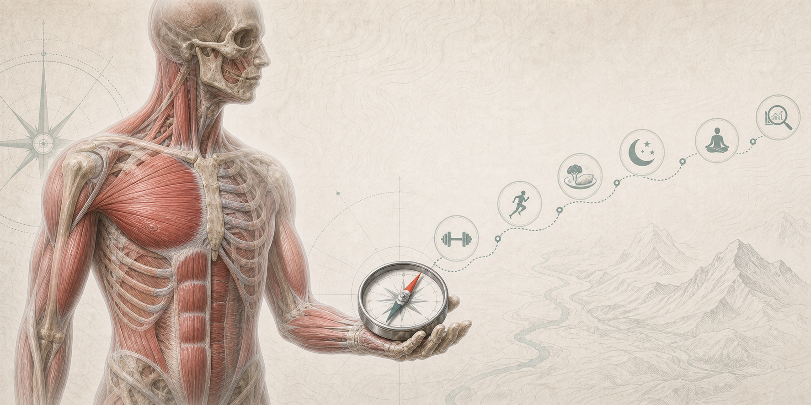

  

# Stefans-Fitness-Kompass

> **Leitsatz:** **Langfristiger Fortschritt entsteht, wenn gute Entscheidungen so einfach werden, dass du sie regelmäßig triffst.**

Ein freier, persönlicher Fitness-Kompass zu Ernährung, Training, Gesundheit, Alltag und Quellenbewertung. Diese README dient als Einstieg; die ausführlichen Kapitel liegen unter [`docs/`](docs/).

---

## Inhaltsverzeichnis

- [Worum es geht](#worum-es-geht)
- [Schnellstart](#schnellstart)
- [Kapitel](#kapitel)
- [Lizenz](#lizenz)

## Worum es geht

Der Kompass ist kein perfekter Wochenplan, sondern ein Entscheidungsrahmen für normale Wochen. Im Mittelpunkt stehen wenige robuste Hebel:

- Kalorienbilanz und Gewichtstrend verstehen.
- Protein, Ballaststoffe und Lebensmittelqualität absichern.
- Krafttraining progressiv und reproduzierbar steuern.
- Ausdauer, Alltagsbewegung, Schlaf und Regeneration ernst nehmen.
- große Gesundheitsrisiken wie Rauchen, Blutdruck, Bauchfett und Alkohol nüchtern priorisieren.
- Quellen kritisch bewerten statt Fitness-Hype zu übernehmen.
- Gewohnheiten so klein bauen, dass sie regelmäßig passieren.

## Schnellstart

Wenn du nur eine Seite lesen willst, starte mit der [Kurzfassung](docs/01-kurzfassung.md). Der pragmatische Einstieg:

- 2 Krafttrainingseinheiten pro Woche planen und protokollieren.
- Pro Hauptmahlzeit eine klare Proteinquelle einbauen.
- Obst, Gemüse, Vollkorn, Hülsenfrüchte oder Kartoffeln täglich zur Basis machen.
- Den 7-Tage-Gewichtstrend statt einzelne Wiegetage bewerten.
- Ausdauer und Alltagsbewegung regelmäßig einbauen.
- Schlaf und Stress wie echte Trainingsfaktoren behandeln.
- Blutdruck, Taillenumfang und Vorsorge nicht dauerhaft aufschieben.
- Bei Diät- oder Massephase wenige Kennzahlen tracken, bis die Richtung klar ist.

## Kapitel

| Kapitel | Inhalt |
| --- | --- |
| [01 Kurzfassung](docs/01-kurzfassung.md) | Kernideen, Minimalstart und wichtigste Botschaften. |
| [02 Quellenbewertung](docs/02-quellenbewertung.md) | Regeln zur Bewertung von Leitlinien, Reviews, Coaches und Influencer-Content. |
| [03 Gewohnheiten und Alltag](docs/03-gewohnheiten-alltag.md) | 1%-Methode, Systeme, Entscheidungsregeln und Wochen-Checkliste. |
| [04 Tracking und Messung](docs/04-tracking.md) | Gewicht, Körpermaße, Makros, Training, Formeln, Richtwerte, Warngrenzen und Tools. |
| [05 Ernährung](docs/05-ernaehrung.md) | Protein, Lebensmittelauswahl, Getränke, Kohlenhydrate, Fettqualität und Supplements. |
| [06 Diätphase](docs/06-diaetphase.md) | Defizit, Hunger, Warnsignale, Refeed, versteckte Kalorien, Einkaufsliste und Anpassung. |
| [07 Massephase](docs/07-massephase.md) | Erhaltung, kontrollierte Massephase, Dirty Bulk, Überschuss und Stoppkorridor. |
| [08 Krafttraining](docs/08-krafttraining.md) | Progression, mTORC1/Hypertrophie, Technik, RIR, Split-Programme und Wochenstruktur. |
| [09 Biomechanik und Übungsauswahl](docs/09-biomechanik-uebungsauswahl.md) | Bewegungsmuster, Zielmuskeln, Übungsauswahl und Prioritäten. |
| [10 Ausdauertraining](docs/10-ausdauertraining.md) | Cardio, Mitochondrien, VO2max, Zone 2, HIIT und Intensitätsmix. |
| [11 Gesundheit und Schlaf](docs/11-gesundheit-schlaf.md) | Schlaf, Alltagsbewegung, Stress, Schmerzsignale und medizinische Basis. |
| [12 Langlebigkeit und Risikofaktoren](docs/12-langlebigkeit-risiken.md) | Große Gesundheitshebel, Risikostatistiken, Krebsrisiken und Prävention. |
| [13 YouTube- und Coachquellen](docs/13-youtube-coachquellen.md) | Praktische Einordnung von Kanälen und Coaches. |
| [14 Fazit](docs/14-fazit.md) | Kompakte Zusammenfassung der robusten Strategie. |
| [15 Quellen](docs/15-quellen.md) | Thematisch sortierte Quellenliste. |
| [16 Über dieses Dokument](docs/16-ueber-dieses-dokument.md) | Stand, Autor, Geltungsbereich, Hinweis und Lizenzdetails. |

## Lizenz

Dieser Fitness-Kompass steht unter [CC0 1.0 Universal](LICENSE). Die Inhalte dürfen kopiert, geteilt, verändert und für beliebige Zwecke genutzt werden. Eine Namensnennung ist nicht erforderlich, aber willkommen.
