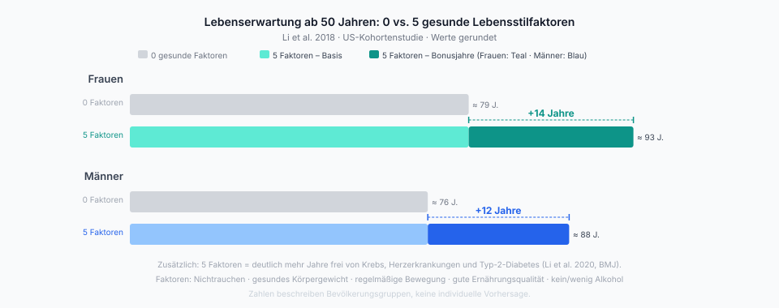

# 00 Warum gesund sein?

  

Wer anfängt, Ernährung, Training und Schlaf ernstzunehmen, hat meistens ein kurzfristiges Ziel vor Augen: abnehmen, fitter werden, Muskeln aufbauen, besser schlafen. Alle diese Ziele sind real und lohnen sich. Aber das vollständige Bild ist größer.

In einer der größten US-Kohortenstudien war ein Bündel aus fünf Lebensstilfaktoren — Nichtrauchen, gesundes Körpergewicht, regelmäßige Bewegung, gute Ernährungsqualität und kein beziehungsweise wenig Alkohol — mit durchschnittlich 14 zusätzlichen Lebensjahren bei Frauen und 12 bei Männern verbunden, verglichen mit Personen ohne diese Faktoren (<a href="https://pmc.ncbi.nlm.nih.gov/articles/PMC6207481/">Li et al. 2018</a>). Das ist kein kleines Randphänomen, sondern der Unterschied zwischen einem Leben, das Anfang 70 endet, und einem, das Ende 80 endet.

  

*Abbildung: Lebenserwartung ab 50 Jahren bei 0 vs. 5 gesunden Lebensstilfaktoren (Li et al. 2018). Zahlen beschreiben Bevölkerungsgruppen, keine individuelle Vorhersage.*

Die Größenordnung lässt sich noch konkreter fassen. Für das Laufen gibt es dazu die robusteste Schätzung: Regelmäßiges Laufen ist in großen Kohortenstudien mit rund drei zusätzlichen Lebensjahren verbunden; bezogen auf typische Trainingszeiten ergibt sich daraus eine grobe Faustformel (<a href="https://www.jacc.org/doi/10.1016/j.jacc.2014.04.058">Lee et al. 2014</a>):

> „Pro Stunde Laufen gewinnt man im Schnitt rund sieben Stunden Lebenszeit zurück."

Das ist keine Formel, die sich unbegrenzt aufstocken lässt — bei sehr hohem Trainingsumfang flacht der Effekt ab, und andere Aktivitäten wie Radfahren, Schwimmen oder Krafttraining folgen ihrer eigenen Kurve. Aber die Größenordnung stimmt: Die Zeitinvestition lohnt sich selbst dann, wenn man sie rein rechnerisch betrachtet.

Noch wichtiger als die Gesamtzahl ist die Art dieser Jahre. Wer mehrere dieser Faktoren kombiniert, verbringt deutlich mehr Zeit frei von Krebs, Herzerkrankungen und Typ-2-Diabetes (<a href="https://www.bmj.com/content/368/bmj.l6669">Li et al. 2020</a>). Die zusätzlichen Jahre sind also überwiegend aktive, selbstständige Jahre — kein verlängertes Leiden am Lebensende, sondern ein echtes Mehr an gutem Leben.

Sport und Bewegung wirken darüber hinaus direkt auf die Psyche. Regelmäßiges Training reduziert Depressions- und Angstsymptome mit Effektstärken, die mit Psychotherapie oder Antidepressiva vergleichbar sind (<a href="https://pmc.ncbi.nlm.nih.gov/articles/PMC11131084/">Noetel et al. 2024</a>). Bessere Stimmung, stabilere Energie, tieferer Schlaf — diese Effekte zeigen sich im Alltag oft schneller als auf der Waage oder im Blutbild. Sie sind für viele der eigentliche tägliche Antrieb, am Ball zu bleiben.

Dieser Kompass fasst die robustesten Hebel aus Ernährung, Training, Schlaf und Alltag zusammen und macht sie wiederholbar. Welche Hebel das sind und wie sie in normalen Wochen funktionieren, zeigt die [Kurzfassung](01-kurzfassung.md).

---
