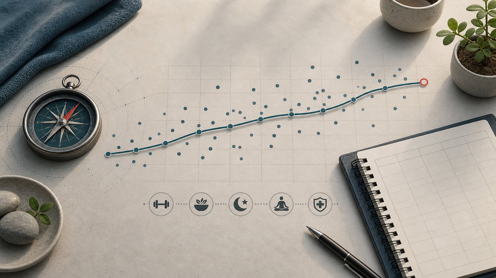

# 01 Kurzfassung

  

Dieser Kompass ist kein Plan für perfekte Wochen, sondern ein Entscheidungsrahmen für normale Wochen. Die Reihenfolge ist bewusst: erst robuste Grundlagen, dann Optimierung.

  

*Abbildung: Die robuste Reihenfolge bleibt erst Alltag, Ernährung, Training, Schlaf und Risikoreduktion; Feintuning kommt danach.*

## 1.1 Die wichtigsten Kernideen

1. **Trends schlagen Tageswerte.** Körpergewicht, Kalorien, Trainingsleistung, Schlaf und Stress schwanken. Entscheidend ist nicht ein einzelner Tag, sondern die Richtung über mehrere Wochen.

2. **Die Kalorienbilanz steuert den Gewichtstrend.** Lebensmittel sind selten allein "gut" oder "schlecht"; Menge, Regelmäßigkeit, Sättigung, Umgebung und Wochenbilanz zählen stärker als einzelne Mahlzeiten.

3. **Protein und Lebensmittelqualität machen die Kalorienbilanz praktikabel.** Protein unterstützt Sättigung, Muskelerhalt und Muskelaufbau; für trainierende Personen ist ein Bereich um 1,4-2,0 g/kg/Tag häufig sinnvoll (<a href="https://jissn.biomedcentral.com/articles/10.1186/s12970-017-0177-8">ISSN 2017a</a>). Die Basis bleibt eine überwiegend pflanzenbetonte, ballaststoffreiche Ernährung mit klaren Proteinquellen, sinnvollen Kohlenhydraten und guter Fettqualität (<a href="https://www.dge.de/gesunde-ernaehrung/gut-essen-und-trinken/dge-empfehlungen/">DGE 2024a</a>).

4. **Kohlenhydrate sind Trainingsenergie, kein Gegner.** Wer hart trainiert, läuft oder viele intensive Einheiten macht, profitiert oft davon, Kohlenhydrate gezielt um Training und Alltag zu planen statt sie pauschal zu meiden.

5. **Muskelaufbau entsteht durch wiederholte Spannung und anschließenden Proteinaufbau.** Mechanische Spannung wird im Muskel in Wachstumssignale übersetzt; mTORC1 ist dabei ein zentraler Signalweg für Muskelproteinsynthese und Zellwachstum (<a href="https://pmc.ncbi.nlm.nih.gov/articles/PMC12927080/">Van Every et al. 2025</a>; <a href="https://pubmed.ncbi.nlm.nih.gov/30335577/">Wackerhage et al. 2019</a>). Muskelkater, Muskelschäden, "Übersäuerung", Brennen oder Pump können auftreten, sind aber keine notwendigen Ursachen und kein zuverlässiger Beweis für Hypertrophie (<a href="https://pubmed.ncbi.nlm.nih.gov/29282529/">Damas et al. 2018</a>).

6. **Training muss hart genug, aber steuerbar sein.** Progression, saubere Technik, Reps in Reserve, sinnvolle Satzpausen und ein Trainingslog sind wichtiger als jedes Mal maximale Erschöpfung. Drop-Sätze, EMOMs und Supersätze können funktionieren, sind aber Werkzeuge und kein Pflichtprogramm.

7. **Gesundheit und Regeneration sind Teil des Plans.** Schlaf, Ausdauer, Alltagsbewegung, Stressmanagement, Schmerzsignale und medizinische Basischecks sind keine Nebenthemen. Gezieltes Cardio verbessert kardiorespiratorische Fitness; VO2max ist dabei ein nützlicher, aber nicht allein entscheidender Marker (<a href="https://www.ncbi.nlm.nih.gov/books/NBK566046/">WHO 2020</a>; <a href="https://pubmed.ncbi.nlm.nih.gov/27881567/">Ross et al. 2016</a>; <a href="https://pmc.ncbi.nlm.nih.gov/articles/PMC4434546/">AASM/SRS 2015</a>).

8. **Langlebigkeit ist die Summe großer vermeidbarer Risiken.** Rauchen, hoher Blutdruck, viszerales Fett, Alkohol, Bewegungsmangel, schlechter Schlaf und verpasste Vorsorge sind größere Hebel als die meisten kleinen Optimierungen. Kohorten und offizielle Gesundheitsquellen zeigen: mehrere gute Lebensstilfaktoren zusammen sind mit deutlich mehr Lebenszeit und gesunder Lebenszeit verbunden (<a href="https://pmc.ncbi.nlm.nih.gov/articles/PMC6207481/">Li et al. 2018</a>; <a href="https://www.bmj.com/content/368/bmj.l6669">Li et al. 2020</a>).

9. **Tracking hilft, ist aber kein Muss.** Gewichtstrend, Ernährung und Training können mit Apps oder einem einfachen Logbuch sichtbarer werden. Die Daten sind Arbeitswerte, keine Identität; sie sollen Entscheidungen erleichtern, nicht Druck erzeugen.

10. **Quellenqualität zählt.** Offizielle Empfehlungen, Leitlinien, Reviews und gute Positionspapiere sind stärker als einzelne Posts, Erfahrungsberichte oder Hype. Coaches und YouTube können praktisch wertvoll sein, ersetzen aber keine solide Quellenprüfung.

11. **Systeme schlagen Motivation.** Gute Gewohnheiten sind klein, konkret und wiederholbar. Ein Plan ist dann gut, wenn er auch bei Alltag, Stress und schwankender Motivation eine Mindestversion ermöglicht.

  

*Abbildung: Einzelne Messpunkte schwanken; die geglättete Richtung über mehrere Wochen ist für Entscheidungen belastbarer.*

## 1.2 Minimaler Startpunkt

- 2 Krafttrainingseinheiten pro Woche planen und protokollieren.
- Pro Hauptmahlzeit eine klare Proteinquelle einbauen.
- Obst, Gemüse, Vollkorn, Hülsenfrüchte oder Kartoffeln täglich zur Basis machen.
- Den 7-Tage-Gewichtstrend statt einzelne Wiegetage bewerten.
- Ausdauer und Alltagsbewegung regelmäßig einbauen: meist locker, bei stabiler Basis optional gezielte Intervalle.
- Schlaf und Stress wie echte Trainingsfaktoren behandeln.
- Blutdruck, Taillenumfang, Vorsorge und Impfstatus nicht dauerhaft aufschieben.
- Bei Diät oder Aufbau wenige Kennzahlen tracken, bis die Richtung klar ist.

---
