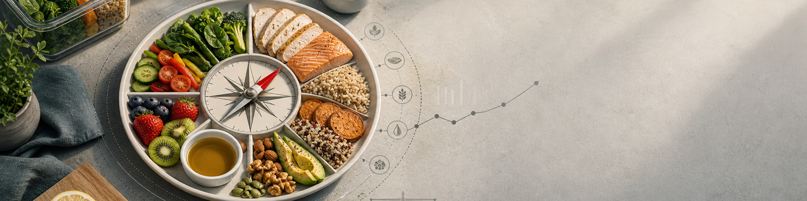

# 03 Ernährung

  

## 3.1 Kalorienbilanz steuert den Gewichtstrend

**Kernaussage:** Körpergewicht verändert sich langfristig vor allem über die Energiebilanz. Einzelne Lebensmittel sind selten das Hauptproblem; Menge, Regelmäßigkeit und Umgebung zählen stärker.

**Praxis:** Tageswerte nicht überbewerten. Aussagekräftiger sind 7-Tage-Gewichtstrend und Entwicklung über 2-4 Wochen.

## 3.2 Protein absichern

**Kernaussage:** Für gesunde Erwachsene von 19 bis unter 65 Jahren nennt die DGE 0,8 g Protein pro kg Körpergewicht und Tag als Referenzwert; für gesunde, normalgewichtige Menschen ab 65 Jahren nennt sie 1,0 g/kg/Tag als Schätzwert (<a href="https://www.dge.de/presse/meldungen/2020/positionspapier-zur-proteinzufuhr-im-sport/">DGE 2020</a>). Diese Werte sind als Basisabsicherung für die allgemeine Bevölkerung zu verstehen, nicht als optimale Zielwerte für Krafttraining, Diät, Muskelaufbau, hohe Sättigung oder bestmöglichen Muskelerhalt. Bei Sportlerinnen und Sportlern mit mehr als 5 Stunden Training pro Woche empfiehlt die DGE je nach Ziel und Trainingszustand 1,2-2,0 g/kg/Tag (<a href="https://www.dge.de/presse/meldungen/2020/positionspapier-zur-proteinzufuhr-im-sport/">DGE 2020</a>). Die ISSN nennt für die meisten trainierenden Personen 1,4-2,0 g/kg/Tag als sinnvollen Bereich (<a href="https://jissn.biomedcentral.com/articles/10.1186/s12970-017-0177-8">ISSN 2017a</a>).

**Zielbereiche:**

- **Allgemeine Gesundheit:** 19 bis unter 65 Jahre etwa 0,8 g/kg/Tag; ab 65 Jahren etwa 1,0 g/kg/Tag als DGE-Schätzwert. Praktisch sind das Untergrenzen für grundlegende Versorgung, nicht die Oberkante dessen, was sinnvoll sein kann.
- **Krafttraining/Muskelaufbau:** häufig 1,6-2,0 g/kg/Tag.
- **Diät/Fettverlust:** häufig 1,8-2,2 g/kg/Tag, besonders bei Krafttraining und hohem Sättigungsbedarf.
- **Sehr hohe Werte:** nur gezielt einsetzen, wenn Ernährung, Nierenfunktion, Flüssigkeitszufuhr und Kontext passen.

**Einordnung:** Wer trainiert, abnehmen will, älter ist, wenig Muskelmasse hat oder hohe Sättigung braucht, liegt oft sinnvoll über der reinen Basisabsicherung. Bei starkem Übergewicht kann eine Berechnung nach Zielgewicht oder fettfreier Masse sinnvoller sein als eine starre Rechnung mit aktuellem Körpergewicht.

**Praxis:** Pro Hauptmahlzeit eine klare Proteinquelle einbauen: Skyr/Quark, Eier, Fisch, Fleisch, Tofu/Tempeh, Hülsenfrüchte oder Proteinpulver bei Bedarf.

## 3.3 Pflanzenbetont essen

**Kernaussage:** Die DGE empfiehlt eine Ernährung, die überwiegend aus pflanzlichen Lebensmitteln besteht. Dazu gehören Obst, Gemüse, Vollkorn, Hülsenfrüchte, Nüsse, Samen und pflanzliche Öle (<a href="https://www.dge.de/gesunde-ernaehrung/gut-essen-und-trinken/dge-empfehlungen/">DGE 2024a</a>; <a href="https://www.dge.de/gesunde-ernaehrung/gut-essen-und-trinken/dge-ernaehrungskreis/">DGE 2024b</a>).

**Praxis:** Jede Hauptmahlzeit aus vier Bausteinen bauen: Proteinquelle, Gemüse/Obst, sättigende Kohlenhydrate, sinnvolle Fettquelle.

## 3.4 Obst und Gemüse täglich priorisieren

**Kernaussage:** Mindestens 5 Portionen Obst und Gemüse pro Tag sind ein guter Marker für Mikronährstoffe, Ballaststoffe, Volumen und Sättigung (<a href="https://www.dge.de/gesunde-ernaehrung/gut-essen-und-trinken/dge-empfehlungen/">DGE 2024a</a>).

**Praxis:** Eine Portion Obst zum Frühstück, Gemüse oder Salat zu Mittag und Abendessen, Tiefkühlgemüse als einfache Reserve.

## 3.5 Ballaststoffe ernst nehmen

**Kernaussage:** Für Erwachsene gilt ein Richtwert von mindestens 30 g Ballaststoffen pro Tag. Ballaststoffe unterstützen Sättigung, Darmgesundheit und Stoffwechselgesundheit (<a href="https://www.dge.de/wissenschaft/faqs/ausgewaehlte-fragen-und-antworten-zu-ballaststoffen/">DGE o. J.</a>).

**Praxis:** Haferflocken, Vollkornbrot, Linsen, Bohnen, Kichererbsen, Kartoffeln, Beeren, Gemüse, Nüsse und Leinsamen regelmäßig einplanen.

## 3.6 Getränke simpel halten

**Kernaussage:** Die DGE empfiehlt rund 1,5 Liter Flüssigkeit pro Tag, am besten Wasser oder ungesüßten Tee (<a href="https://www.dge.de/gesunde-ernaehrung/gut-essen-und-trinken/dge-empfehlungen/">DGE 2024a</a>). Für Sportlerinnen und Sportler kann der Bedarf durch Körpergröße, Hitze, Schweißrate und Trainingsumfang deutlich höher liegen; 3-5 Liter pro Tag können an langen Trainings- oder Hitzetagen plausibel sein (<a href="https://pubmed.ncbi.nlm.nih.gov/17277604/">ACSM 2007</a>).

**Praxis:** Im Alltag gilt als einfache Regel: Getränke sind kalorienfrei. Wasser, Mineralwasser, ungesüßter Tee und schwarzer Kaffee sind die Basis; zuckerhaltige Getränke, Saft, Smoothies, Milchshakes und Alkohol sind Kalorienquellen und sollten bewusst eingeplant werden.

**Zero-Getränke:** Wenn die echte Alternative ein Zuckergetränk ist, sind Zero-Getränke für Kalorienbilanz und Diätsteuerung klar die bessere Wahl. Süßstoffe sind deutlich süßer als Zucker und werden deshalb in sehr kleinen Mengen eingesetzt; zugelassene Süßstoffe liefern keine oder kaum Energie und erhöhen im Allgemeinen den Blutzucker nicht relevant (<a href="https://www.fda.gov/food/food-additives-petitions/high-intensity-sweeteners">FDA 2017</a>). Das heißt nicht, dass Zero-Getränke "gesund machen". Sie sind ein Werkzeug, um Zucker und Flüssigkalorien zu ersetzen.

**Was im Körper passiert:** Süßstoffe sind keine einheitliche Stoffklasse. Aspartam wird im Darm rasch in Phenylalanin, Asparaginsäure und Methanol zerlegt; diese Stoffe kommen auch in normalen Lebensmitteln vor. Für Menschen mit Phenylketonurie (PKU) ist Aspartam wegen Phenylalanin relevant und muss gemieden bzw. streng begrenzt werden (<a href="https://www.efsa.europa.eu/en/press/news/131210">EFSA 2013</a>; <a href="https://www.fda.gov/food/food-additives-petitions/high-intensity-sweeteners">FDA 2017</a>). Andere Süßstoffe wie Sucralose, Acesulfam-K oder Steviolglykoside werden anders verstoffwechselt; gemeinsam ist vor allem, dass sie sehr hohe Süßkraft bei wenig oder keiner Energie liefern.

**Was belegt ist:** Randomisierte Studien und systematische Reviews sprechen dafür, dass Süßstoffe kurzfristig Zucker- und Energiezufuhr senken können, wenn sie Zucker ersetzen; besonders klar ist der Nutzen, wenn Zero-Getränke statt zuckergesüßter Getränke getrunken werden (<a href="https://www.who.int/publications/i/item/9789240046429">WHO 2022</a>; <a href="https://jamanetwork.com/journals/jamanetworkopen/fullarticle/2790045">McGlynn et al. 2022</a>). Nicht belegt ist, dass Süßstoffe unabhängig von der Kalorienbilanz Fettverlust auslösen, den Stoffwechsel "zerstören" oder automatisch Heißhunger verursachen. Die WHO empfiehlt Süßstoffe nicht als eigenständige Langzeitstrategie zur Gewichtskontrolle oder Prävention chronischer Erkrankungen, weil langfristige Vorteile auf Körperfett nicht klar belegt sind und Beobachtungsdaten unsicher bleiben (<a href="https://www.ncbi.nlm.nih.gov/books/NBK592246/">WHO 2023</a>).

**Pragmatische Regel:** Wasser bleibt Standard. Zero-Getränke sind sinnvoll, wenn sie Zuckergetränke, Saft, Eistee, Energy-Drinks oder Alkoholkalorien ersetzen. Sie sind weniger sinnvoll, wenn sie nur zusätzlich kommen, Süßhunger triggern oder als Ausrede dienen, an anderer Stelle mehr zu essen.

**Sport-Kontext:** Bei kurzen Einheiten reicht meist Wasser. Bei langen Einheiten über etwa 60-90 Minuten, hoher Hitze, starkem Schwitzen oder mehreren Einheiten pro Tag können Elektrolyte sinnvoll sein. Natrium ist dabei der wichtigste Schweiß-Elektrolyt; es unterstützt Flüssigkeitsaufnahme und Flüssigkeitsbindung. Flüssigkalorien in Sportdrinks sind dann keine Alltagsgetränke, sondern gezielte Energiezufuhr während Belastung (<a href="https://pubmed.ncbi.nlm.nih.gov/17277604/">ACSM 2007</a>; <a href="https://jissn.biomedcentral.com/articles/10.1186/s12970-017-0189-4">ISSN 2017b</a>).

**Warnsignal:** Nicht zwanghaft übertrinken. Bei langen Ausdauereinheiten ist zu viel Wasser ohne ausreichend Natrium problematisch, weil es das Risiko für Hyponatriämie erhöhen kann (<a href="https://pubmed.ncbi.nlm.nih.gov/17277604/">ACSM 2007</a>).

## 3.7 Kohlenhydrate als Trainingsenergie nutzen

**Kernaussage:** Kohlenhydrate sind kein Gegenspieler von Gesundheit oder Fettverlust. Sie sind der wichtigste schnell verfügbare Trainingsbrennstoff für Krafttraining mit hohem Volumen, intensive Einheiten, Laufen und Sportarten mit wiederholten Belastungsspitzen (<a href="https://jissn.biomedcentral.com/articles/10.1186/s12970-017-0189-4">ISSN 2017b</a>; <a href="https://jissn.biomedcentral.com/articles/10.1186/s12970-017-0177-8">ISSN 2017a</a>).

**Vor dem Training:** 2-4 Stunden vor dem Training ist eine Mahlzeit aus Kohlenhydraten plus Protein sinnvoll, z. B. Reis/Kartoffeln/Hafer/Brot/Pasta plus eine Proteinquelle. Wenn die letzte Mahlzeit lange her ist, kann 30-60 Minuten vorher ein kleiner Snack helfen, z. B. Banane, Brot, Reiswaffeln oder etwas leicht Verdauliches (<a href="https://jissn.biomedcentral.com/articles/10.1186/s12970-017-0189-4">ISSN 2017b</a>).

**Nach dem Training:** Kohlenhydrate nach dem Training füllen Muskelglykogen wieder auf. Für Muskelaufbau ist das vor allem indirekt wichtig: Bessere Glykogenverfügbarkeit unterstützt Trainingsleistung, Trainingsvolumen, Erholung und damit den nächsten wirksamen Trainingsreiz. Der direkte Hauptreiz für Muskelproteinaufbau bleibt die Kombination aus Krafttraining und ausreichendem Protein (<a href="https://jissn.biomedcentral.com/articles/10.1186/s12970-017-0189-4">ISSN 2017b</a>; <a href="https://jissn.biomedcentral.com/articles/10.1186/s12970-017-0177-8">ISSN 2017a</a>).

**Praxis:** Nach dem Training eine normale Mahlzeit aus Protein plus Kohlenhydraten einplanen. Besonders wichtig wird das, wenn die Einheit lang oder sehr intensiv war, wenn am selben oder nächsten Tag wieder trainiert wird oder wenn Muskelaufbau mit Kalorienüberschuss das Ziel ist.

**Einordnung:** Es gibt kein zwingendes 30-Minuten-Fenster für normale Krafttrainingseinheiten, wenn Tageskalorien und Tagesprotein passen. Je höher Trainingsvolumen, Ausdaueranteil und Einheitenfrequenz sind, desto wichtiger wird gezieltes Carb-Timing (<a href="https://jissn.biomedcentral.com/articles/10.1186/s12970-017-0189-4">ISSN 2017b</a>; <a href="https://jissn.biomedcentral.com/articles/10.1186/s12970-017-0177-8">ISSN 2017a</a>).

## 3.8 Fettqualität verbessern

**Kernaussage:** Fette sind wichtig für Zellfunktionen, Hormonsystem und Sättigung. Entscheidend ist vor allem die Qualität und der Kontext der Ernährung.

**Praxis:** Rapsöl, Olivenöl, Nüsse, Samen, Avocado und Fisch bevorzugen. Frittierte Snacks, Süßwaren und stark verarbeitete Fett-Zucker-Kombinationen nicht zur Basis machen.

## 3.9 Alkohol niedrig halten

**Kernaussage:** Es gibt keine risikofreie Alkoholmenge. Wer nicht trinkt, sollte nicht anfangen; wer trinkt, sollte Menge und Häufigkeit niedrig halten (<a href="https://www.dge.de/gesunde-ernaehrung/faq/alkohol/">DGE 2024c</a>).

**Praxis:** Alkohol nicht als Regenerationsgetränk behandeln. Besonders in Diät-, Trainings- und Schlafphasen kritisch sehen.

## 3.10 Flexibilität einplanen

**Kernaussage:** Eine Ernährung muss alltagstauglich bleiben. Ein zu perfekter Plan scheitert oft schneller als ein robuster Plan mit Spielraum.

**Praxis:** Lieblingsessen einplanen, nicht als "Cheat" behandeln. Die Wochenbilanz zählt mehr als einzelne Mahlzeiten.

---

## 3.11 Ernährung in der Praxis

### 3.11.1 Teller-Modell

- **1/2 Teller:** Gemüse, Salat oder Obst.
- **1/4 Teller:** Proteinquelle.
- **1/4 Teller:** sättigende Kohlenhydrate.
- **Zusatz:** kleine, hochwertige Fettquelle.

### 3.11.2 Minimal-Tracking

Für die meisten Ziele reichen wenige Kennzahlen:

- Körpergewicht als Wochenschnitt.
- Protein täglich grob absichern.
- Kalorien temporär oder grob tracken, wenn Gewichtsziel wichtig ist.
- Training dokumentieren.
- Schritte, Bewegung und Schlafqualität beobachten.

### 3.11.3 Tracking-Apps und Tools

Tracking ist kein Muss. Es kann aber helfen, langfristig den Überblick zu behalten und Diät- oder Aufbauphasen besser zu steuern. App-Werte sind Arbeitswerte, keine Wahrheit: Etiketten, Portionsgrößen und Körpergewichtstrend bleiben wichtiger als einzelne App-Schätzungen.

| Kategorie | Top-3-Beispiele | Hilft vor allem bei |
| --- | --- | --- |
| Körpergewicht und Trend | <a href="https://play.google.com/store/apps/details?id=net.cachapa.libra">Libra</a>, <a href="https://happyscale.com/">Happy Scale</a>, <a href="https://github.com/oliexdev/openScale">openScale</a> | Tagesgewicht glätten, 7-Tage-Trend sehen, Plateaus nüchterner einordnen |
| Ernährung, Kalorien und Makros | <a href="https://fddb.info/">FDDB</a>, <a href="https://www.yazio.com/">YAZIO</a>, <a href="https://www.myfitnesspal.com/">MyFitnessPal</a> | Kalorien, Protein, Ballaststoffe, Mahlzeiten und Rezepte grob steuern |
| Krafttraining und Logbuch | <a href="https://www.hevyapp.com/">Hevy</a>, <a href="https://www.strong.app/">Strong</a>, <a href="https://www.fitnotesapp.com/">FitNotes</a> | Übungen, Gewicht, Wiederholungen, Sätze, RIR/RPE, Pausen und Progression dokumentieren |

**Praxis:** Für viele reicht eine App pro Kategorie oder sogar nur ein einfaches Notizbuch. Wichtiger als die perfekte App ist, dass die Daten regelmäßig, ehrlich und ohne Zwang erfasst werden.

### 3.11.4 Diät-Regeln

- Defizit moderat halten, nicht maximal.
- Protein eher hoch halten.
- Krafttraining beibehalten.
- Schritte erhöhen, bevor Kalorien extrem gedrückt werden.
- Stagnation erst nach 2-3 Wochen Trend bewerten.
- Als grobe Orientierung ist eine Gewichtsabnahme von etwa 0,5-1,0 % des Körpergewichts pro Woche für viele Diätphasen realistischer als Crash-Diäten.
- Schlafmangel nicht mit noch mehr Koffein und noch weniger Essen kompensieren.

**Einordnung:** Je schlanker, sportlicher oder leistungsorientierter jemand ist, desto konservativer sollte das Defizit geplant werden.

**Schritte als Defizit-Werkzeug:** Wenn der Gewichtstrend stagniert, sind zusätzliche Schritte oft die erste Bewegungsschraube, bevor Kalorien stark gesenkt oder harte Cardioeinheiten ergänzt werden. Alltagsbewegung erhöht den Energieverbrauch niedrigschwellig und ist für viele leichter durchzuhalten als zusätzliche intensive Einheiten. Der Effekt ist trotzdem endlich: Schritte helfen beim Defizit, ersetzen aber keine Kontrolle von Kalorien, Protein, Schlaf und Wochenbilanz.

### 3.11.5 Muskelaufbau-Regeln

- Leichter Kalorienüberschuss reicht.
- Sinnvoller Startbereich: etwa 100-300 kcal/Tag über Erhalt oder ca. 5-10 % über Erhaltungskalorien; das ist ein Startwert, kein Gesetz.
- Gewichtszunahme langsam halten; je fortgeschrittener, desto kleiner sollte der Überschuss sein.
- Protein absichern.
- Progressives Krafttraining ist Pflicht.
- Wenn Bauchumfang schnell steigt, aber Trainingsleistung kaum besser wird: Überschuss prüfen.

**Einordnung:** Ziel ist nicht maximale Gewichtszunahme, sondern messbarer Trainingsfortschritt bei kontrollierter Körperfettzunahme.

### 3.11.6 Supplements

**Grundsatz:** Supplements ergänzen, ersetzen aber nicht Ernährung, Training, Schlaf und Konsistenz.

**Sinnvolle Kandidaten:**

- **Protein/Whey:** praktisch, wenn Lebensmittel nicht reichen (<a href="https://www.dge.de/presse/meldungen/2020/positionspapier-zur-proteinzufuhr-im-sport/">DGE 2020</a>; <a href="https://jissn.biomedcentral.com/articles/10.1186/s12970-017-0177-8">ISSN 2017a</a>).
- **Kreatin-Monohydrat:** gut untersucht; häufig 3-5 g/Tag als einfache Praxisdosis (<a href="https://jissn.biomedcentral.com/articles/10.1186/s12970-017-0173-z">ISSN 2017c</a>).
- **Elektrolyte/Natrium:** situationsabhängig sinnvoll bei langen, heißen oder sehr schweißtreibenden Ausdauerbelastungen (<a href="https://pubmed.ncbi.nlm.nih.gov/17277604/">ACSM 2007</a>).
- **Vitamin D, B12, Eisen, Omega-3:** abhängig von Ernährung, Blutwerten, Symptomen oder fachlicher Einschätzung.

**Nicht priorisieren:**

- Detox-Produkte.
- Fatburner.
- Testosteron-Booster ohne medizinischen Befund.
- teure Spezialprodukte ohne klaren Nutzen.

---
