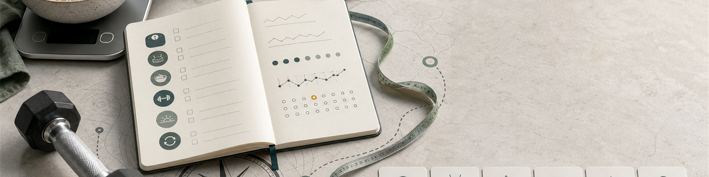

# 04 Tracking und Messung

<p align="center">
  
</p>

Tracking bedeutet in diesem Kompass: messen, um den eigenen Alltag besser zu verstehen. Es ist ein Werkzeug zum Lernen, nicht ein Beweis für Disziplin und keine Pflicht, dauerhaft alles zu erfassen. Gute Daten machen Trends sichtbar, schlechte Daten erzeugen nur Scheinsicherheit. Bei Essstörungen, zwanghaftem Kontrollverhalten, starker Angst vor Gewicht oder Kalorien, Essanfällen oder sozialem Rückzug ist weniger Tracking und fachliche Hilfe sinnvoller als mehr Genauigkeit.

## 4.1 Grundsatz: messen, einordnen, entscheiden

Eine Messung ist erst nützlich, wenn sie zu einer besseren Entscheidung führt. Körpergewicht, Kalorien, Makros, Training, Schritte, Schlaf und Körpermaße sind deshalb Arbeitswerte. Sie zeigen Richtung und Kontext, aber sie ersetzen nicht Körpergefühl, Alltag, Gesundheit oder ärztliche Diagnostik.

Tracking funktioniert am besten als zeitlich begrenzte Kalibrierung: 2-4 Wochen ehrlich erfassen, Muster erkennen, ein oder zwei Stellschrauben ändern und danach wieder vereinfachen. In Diätphase und Massephase kann Tracking enger sein; in Erhaltung reichen oft wenige Kontrollpunkte. Systematische Reviews zu Gewichtsmanagement zeigen, dass Self-Monitoring helfen kann, vor allem wenn Ernährung, Bewegung und Gewicht regelmäßig und praktikabel erfasst werden (<a href="https://pmc.ncbi.nlm.nih.gov/articles/PMC3268700/">Burke et al. 2011</a>). Der Nutzen kommt aber nicht aus der App, sondern aus Wiederholbarkeit und Rückkopplung.

## 4.2 Messstandard: gleiche Bedingungen statt mehr Daten

Mehr Daten sind nicht automatisch bessere Daten. Wichtiger ist, dass unter ähnlichen Bedingungen gemessen wird und der Trend betrachtet wird.

| Messwert | Einfaches Mittel | Methode | Häufigkeit | Grenze |
| --- | --- | --- | --- | --- |
| Körpergewicht | normale Waage | morgens nach Toilette, vor Essen und Trinken | 3-7x/Woche, als 7-Tage-Schnitt | Tagesgewicht schwankt durch Salz, Kohlenhydrate, Wasser, Verdauung und Zyklus |
| Taille | flexibles Maßband | gleiche Stelle, Band waagerecht, entspannt stehen, nach normalem Ausatmen | 1x/Woche oder alle 2 Wochen | nicht täglich messen; kleine Fehler sind normal |
| Körpermaße | Maßband | Brust, Oberarm, Hüfte, Oberschenkel nur bei Bedarf | alle 2-4 Wochen | Pump, Muskelkater und Messpunkt verändern Werte |
| Ernährung | Küchenwaage, Etikett, App | energiedichte Lebensmittel, Öl, Nüsse, Snacks und Standardrezepte genauer erfassen | zeitweise, besonders in Zielphasen | App-Datenbanken und Portionsgrößen sind Schätzungen |
| Training | Notizbuch oder App | Übung, Last, Wiederholungen, Sätze, RIR/RPE, Notiz | jede Einheit | ohne Technik- und Kontextnotiz wird Progression schnell missverständlich |
| Blutdruck | Oberarmmessgerät | sitzend, ruhig, Manschette passend, mehrere Messungen | bei Bedarf oder Risiko | wiederholt hohe Werte fachlich abklären |
| Schritte und Schlaf | Smartphone, Uhr, Ring | als Trend nutzen, nicht als exakte Wahrheit | täglich passiv möglich | Kalorienverbrauch und Schlafphasen sind oft ungenau |

Fotos können helfen, wenn sie selten und standardisiert gemacht werden: gleiche Uhrzeit, Licht, Abstand, Kleidung und Haltung. Sie sind optional. Wer dadurch stärker grübelt oder sich ständig bewertet, lässt sie weg.

## 4.3 Gewicht, Taille und Körpermaße einordnen

Das Körpergewicht ist ein lauter Messwert. Ein einzelner Wiegetag sagt wenig, ein 7-Tage-Schnitt über mehrere Wochen sagt deutlich mehr. In Diätphasen zählt, ob der Trend fällt; in Massephasen zählt, ob der Trend langsam steigt und Training sowie Taille dazu passen.

Der BMI ist eine grobe Bevölkerungsmetrik: `Körpergewicht in kg / Größe in m²`. Die CDC ordnet 18,5-24,9 als Normalgewicht, 25,0-29,9 als Übergewicht und ab 30 als Adipositas ein (<a href="https://www.cdc.gov/bmi/adult-calculator/bmi-categories.html">CDC 2024</a>). Für muskulöse Personen ist BMI allein begrenzt, weil er Fett- und Muskelmasse nicht trennt. Deshalb sind Taillenumfang, Blutdruck, Blutwerte, Leistungsfähigkeit und Kontext wichtiger als eine einzelne Zahl.

Taille ist für Gesundheitsrisiken oft aussagekräftiger als Gewicht allein. NIDDK und NHLBI nennen erhöhte Risikobereiche bei mehr als 102 cm Taillenumfang für Männer und mehr als 88 cm für Frauen (<a href="https://www.niddk.nih.gov/health-information/weight-management/adult-overweight-obesity/am-i-healthy-weight">NIDDK 2023</a>; <a href="https://www.nhlbi.nih.gov/health/heart-healthy-living/healthy-weight">NHLBI o. J.</a>). Die waist-to-height ratio ist eine einfache Zusatzmetrik: `Taillenumfang / Körpergröße`. NICE empfiehlt, die Taille möglichst unter der Hälfte der Körpergröße zu halten; ab etwa 0,5 steigt das Risiko, ab etwa 0,6 wird es deutlich problematischer (<a href="https://www.nice.org.uk/guidance/ng246/chapter/Recommendations">NICE 2025</a>).

Körperfettwaagen, Uhren und Scanner können Trends liefern, sind aber keine exakte Körperfettmessung. Hydration, Salz, Training, Hauttemperatur und Gerätelogik verändern die Anzeige. Wer solche Werte nutzt, bewertet nur den mehrwöchigen Verlauf und nicht die Nachkommastelle.

## 4.4 Ernährung und Makros tracken

Ernährungstracking soll Portionen kalibrieren. Viele Menschen lernen erst durch 2-4 Wochen Wiegen, wie viel Energie Öl, Nüsse, Käse, Saucen, Getränke, Snacks und Restaurantportionen tatsächlich liefern. Danach reichen oft Standardportionen, feste Mahlzeiten und gelegentliche Stichproben.

Die Reihenfolge ist wichtig. Zuerst zählt die Energiezufuhr, wenn das Körpergewicht gezielt verändert werden soll. Danach kommen Protein, Ballaststoffe, Lebensmittelauswahl und die Frage, ob der Plan sättigt. Fett und Kohlenhydrate werden meistens nach Präferenz, Training und Verträglichkeit verteilt, solange die Ernährung insgesamt nährstoffreich bleibt.

| Metrik | Häufig sinnvoller Zielbereich | Einordnung |
| --- | ---: | --- |
| Protein | allgemein mindestens Referenzwert; bei Training häufig 1,4-2,0 g/kg/Tag | DGE nennt für Sport je nach Ziel und Umfang 1,2-2,0 g/kg/Tag; ISSN nennt 1,4-2,0 g/kg/Tag als sinnvollen Bereich (<a href="https://www.dge.de/presse/meldungen/2020/positionspapier-zur-proteinzufuhr-im-sport/">DGE 2020</a>; <a href="https://jissn.biomedcentral.com/articles/10.1186/s12970-017-0177-8">ISSN 2017a</a>) |
| Ballaststoffe | mindestens 30 g/Tag als Richtwert | unterstützt Sättigung und Ernährungqualität; DGE nennt 30 g/Tag für Erwachsene (<a href="https://www.dge.de/wissenschaft/faqs/ausgewaehlte-fragen-und-antworten-zu-ballaststoffen/">DGE o. J.</a>) |
| Kalorien | abhängig von Ziel und Trend | Rechner sind Startwerte; Körpergewichtstrend entscheidet |
| Fett und Kohlenhydrate | flexibel im Rahmen einer nährstoffreichen Ernährung | nicht isoliert optimieren, bevor Kalorien, Protein, Ballaststoffe und Lebensmittelqualität passen |

Makros müssen nicht jeden Tag perfekt treffen. Ein Wochenmittel ist meist aussagekräftiger als ein einzelner Tag. Wer sehr genau trackt, sollte trotzdem nicht vergessen, dass Etiketten, Restaurantangaben und App-Datenbanken nur Näherungen sind.

## 4.5 Training tracken

Ein Trainingslog macht Fortschritt sichtbar. Minimum ist: Datum, Übung, Sätze, Wiederholungen, Gewicht und eine kurze Notiz zur Satznähe zum Versagen oder zur Technik. Für Hypertrophie sind harte Sätze pro Muskelgruppe und Woche, RIR/RPE, Übungsauswahl und Regeneration wichtiger als eine perfekte App-Auswertung.

```text
Datum:
Schlaf / Energie:
Übung | Gewicht | Wiederholungen | Sätze | RIR/RPE | Notiz
Nächster Schritt:
```

Leistung wird nur vergleichbar, wenn die Bewegung vergleichbar bleibt. Mehr Gewicht bei deutlich kürzerem Bewegungsumfang, mehr Schwung oder schlechterer Kontrolle ist nicht automatisch Fortschritt. Bei Schmerzen wird nicht nur weitergetrackt, sondern Übungsauswahl, Technik, Volumen und Belastung werden geprüft.

## 4.6 Formeln und Metriken

Formeln sind Arbeitswerte. Sie helfen beim Start, aber der Trend entscheidet.

| Metrik | Formel | Nutzen | Grenze |
| --- | --- | --- | --- |
| BMI | `kg / m²` | grobe Gewichtskategorie | trennt Muskel- und Fettmasse nicht |
| Waist-to-height ratio | `Taillenumfang / Körpergröße` | einfache Risikoeinordnung für zentrale Fettverteilung | Messpunkt und Körperbau beeinflussen den Wert |
| 7-Tage-Gewichtsschnitt | `Summe der letzten 7 Morgengewichte / 7` | glättet Wasser- und Verdauungsschwankungen | braucht regelmäßige Messung |
| Gewichtsänderung pro Woche | `(Trend Woche 2 - Trend Woche 1) / Körpergewicht x 100` | Diät- oder Massephase steuern | bei kurzen Zeiträumen zu laut |
| Mifflin-St.-Jeor Männer | `10 x kg + 6,25 x cm - 5 x Alter + 5` | Startwert für Ruheenergieverbrauch | Aktivitätsfaktor und Anpassung bleiben nötig (<a href="https://pubmed.ncbi.nlm.nih.gov/2305711/">Mifflin et al. 1990</a>) |
| Mifflin-St.-Jeor Frauen | `10 x kg + 6,25 x cm - 5 x Alter - 161` | Startwert für Ruheenergieverbrauch | individueller Verbrauch kann abweichen |
| Erhaltung aus Trend | `Durchschnittskalorien - (Gewichtsänderung kg/Woche x 7.700 / 7)` | persönliche Erhaltung grob rückrechnen | Wasser, Salz, Zyklus, Krankheit und Trackingfehler verzerren |
| Defizit oder Überschuss | `Zielkalorien - Erhaltungskalorien` | Energieziel planen | kleine Unterschiede gehen im Alltagsrauschen unter |
| e1RM nach Epley | `Gewicht x (1 + Wiederholungen / 30)` | Krafttrend grob schätzen | nur bei ähnlicher Technik und moderaten Wiederholungen brauchbar |

1 kg Körperfett entspricht grob 7.700 kcal. Das ist ein Rechenanker, kein Versprechen der Waage. Dynamische Modelle wie der NIDDK Body Weight Planner zeigen genauer, dass Körpergewicht, Energieverbrauch und Anpassungen sich gegenseitig beeinflussen (<a href="https://www.niddk.nih.gov/bwp">NIDDK Body Weight Planner</a>; <a href="https://pmc.ncbi.nlm.nih.gov/articles/PMC3880593/">Hall et al. 2011</a>).

## 4.7 Richtwerte und Warngrenzen

Richtwerte sind Orientierung, keine Diagnose. Eine einzelne Zahl wird nur dann wichtig, wenn sie wiederholt auffällig ist oder zusammen mit Beschwerden, Medikamenten, Erkrankungen oder starkem Leidensdruck auftritt.

| Bereich | Häufig sinnvoller Ziel- oder Prüfwert | Warnsignal |
| --- | --- | --- |
| Diätphase | etwa 0,5-1,0 % Körpergewicht pro Woche | dauerhaft schneller Verlust, Leistungsabfall, Schlafprobleme, Essanfälle |
| Massephase | etwa 0,25-0,5 % Körpergewicht pro Woche | Taille steigt schnell, Leistung steigt nicht, Blutdruck oder Schlaf werden schlechter |
| Taille | unter 102 cm Männer, unter 88 cm Frauen; zusätzlich waist-to-height ratio unter 0,5 anstreben | deutlich darüber, schnell steigend oder zusammen mit Blutdruck-/Blutzuckerproblemen |
| Blutdruck | AHA: normal unter 120/80 mmHg | wiederholt erhöht, besonders ab 130/80 mmHg oder bei Symptomen fachlich klären (<a href="https://www.heart.org/en/health-topics/high-blood-pressure/understanding-blood-pressure-readings">AHA 2024</a>) |
| Bewegung | mindestens 150 Minuten moderat oder 75 Minuten intensiv pro Woche plus 2 Tage Krafttraining | dauerhaft sehr wenig Bewegung oder stark fallende Belastbarkeit (<a href="https://www.cdc.gov/physical-activity-basics/guidelines/adults.html">CDC 2025c</a>) |
| Schlaf | Erwachsene brauchen häufig mindestens 7 Stunden | dauerhaft unter 6 Stunden, starke Tagesmüdigkeit, Schnarchen mit Atemaussetzern (<a href="https://www.cdc.gov/sleep/about/index.html">CDC 2024b</a>) |
| Trackingverhalten | Daten erleichtern Entscheidungen | Angst, Zwang, sozialer Rückzug, ständiges Nachrechnen oder Kompensieren |

## 4.8 Tools, Apps und Notizbuch

Apps können Arbeit sparen, vor allem bei Trends und Datenbanken. Sie können aber auch Reibung, Ablenkung und falsche Genauigkeit erzeugen. Für viele reicht eine App pro Kategorie oder ein einfaches Notizbuch.

| Kategorie | Beispiele | Wofür nutzen |
| --- | --- | --- |
| Gewichtstrend | <a href="https://play.google.com/store/apps/details?id=net.cachapa.libra">Libra</a>, <a href="https://happyscale.com/">Happy Scale</a>, <a href="https://github.com/oliexdev/openScale">openScale</a> | Tagesgewicht glätten, Trend sehen, Plateaus nüchterner einordnen |
| Ernährung | <a href="https://fddb.info/">FDDB</a>, <a href="https://www.yazio.com/">YAZIO</a>, <a href="https://www.myfitnesspal.com/">MyFitnessPal</a> | Kalorien, Protein, Ballaststoffe, Mahlzeiten und Rezepte grob steuern |
| Training | <a href="https://www.hevyapp.com/">Hevy</a>, <a href="https://www.strong.app/">Strong</a>, <a href="https://www.fitnotesapp.com/">FitNotes</a> | Übungen, Last, Wiederholungen, Sätze, RIR/RPE, Pausen und Progression dokumentieren |
| Wearables | Uhr, Ring, Schrittzähler | Schritte, Ruhepuls, Schlafdauer und Belastungstrends beobachten |

Ein klassisches Notizbuch hat echte Vorteile: Es ist schnell, offline, lenkt weniger ab und erlaubt Kontext statt nur Zahlen. "Schlecht geschlafen, Kniebeuge schwer, Technik stabil" ist oft wertvoller als zehn automatisch berechnete Scores. Ein Notizbuch zwingt außerdem zur Auswahl: Was ist wirklich entscheidungsrelevant?

## 4.9 Minimal-Setups

Für Erhaltung reicht oft ein leichtes Setup: Training loggen, Gewichtstrend gelegentlich prüfen, Schritte oder Bewegung im Blick behalten und alle paar Wochen kurz reflektieren.

Für eine Diätphase wird enger gemessen: 7-Tage-Gewichtsschnitt, Kalorien oder Standardportionen, Protein, Schritte, Training, Hunger, Schlaf und wöchentlicher Taillentrend. Details zur Umsetzung stehen in [06 Diätphase](06-diaetphase.md).

Für eine Massephase zählen vor allem Gewichtstrend, Taillenumfang, Trainingsprogression, Schlaf, Verdauung und Appetit. Kalorien werden nur so genau getrackt, wie nötig ist, um den Überschuss klein zu halten. Die praktische Steuerung steht in [07 Massephase](07-massephase.md).

---
