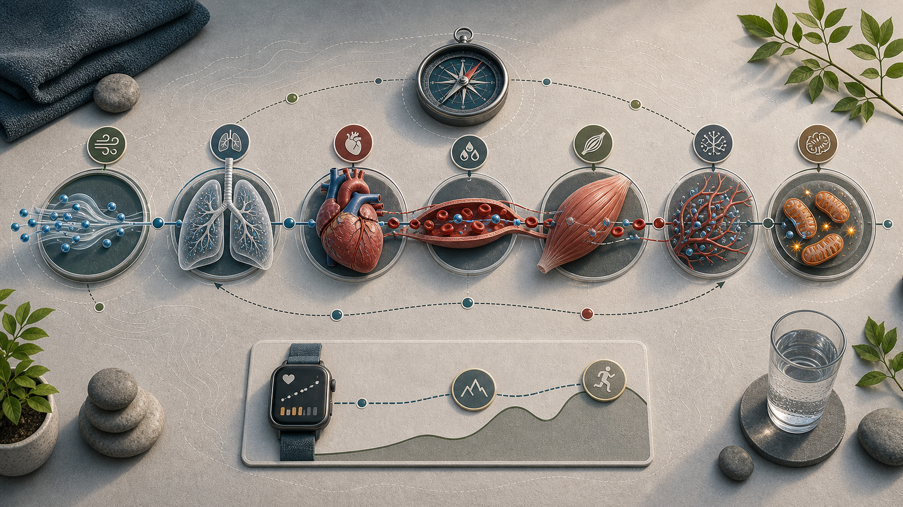

# 05 Ausdauertraining

  

Ausdauertraining muss nicht nach Wettkampfplan aussehen. Schon ein ruhiger, wiederholbarer Mix aus lockerer Basisarbeit, langsam steigendem Umfang und wenigen harten Reizen kann Herz-Kreislauf-Fitness, Sauerstoffnutzung und Belastbarkeit verbessern. Schritte bleiben die Alltagsbasis; Ausdauertraining ist der geplante Reiz.

## 5.1 Ausdauer ergänzen

Ausdauertraining verbessert Herz-Kreislauf-Fitness, Belastbarkeit, Erholung und Alltag. Es muss nicht jedes Mal hart sein. Für Erwachsene nennen die WHO-Leitlinien 150-300 Minuten moderate oder 75-150 Minuten intensive aerobe Aktivität pro Woche als robuste Gesundheitsbasis, zusätzlich zu Krafttraining (<a href="https://www.ncbi.nlm.nih.gov/books/NBK566046/">WHO 2020</a>).

**Warum es zählt:** Regelmäßige aerobe Aktivität ist mit niedrigerer Gesamtsterblichkeit, niedrigerer Herz-Kreislauf-Sterblichkeit, geringerem Risiko für Hypertonie, Typ-2-Diabetes und bestimmte Krebsarten sowie besseren Ergebnissen bei Angst- und Depressionssymptomen, kognitiver Gesundheit und Schlaf verbunden (<a href="https://www.ncbi.nlm.nih.gov/books/NBK566046/">WHO 2020</a>). Kardiorespiratorische Fitness ist außerdem ein starker Gesundheitsmarker; in großen Kohorten ist höhere Fitness konsistent mit niedrigerem Risiko für Sterblichkeit und Herz-Kreislauf-Ereignisse verbunden (<a href="https://jamanetwork.com/journals/jama/fullarticle/1108396">Kodama et al. 2009</a>; <a href="https://pubmed.ncbi.nlm.nih.gov/27881567/">Ross et al. 2016</a>).

Für die Praxis heißt das: viele lockere Einheiten, wenige harte Einheiten und den Laufumfang langsam steigern. Wer wenig Zeit hat, kann mit 2 lockeren Einheiten pro Woche starten und später eine gezielte Intervall-Einheit ergänzen.

**Abgrenzung zu Schritten:** Alltagsbewegung und Schritte sind die Grundlage, Cardio ist der gezielte Trainingsreiz. Wer Fett verlieren will, sollte zuerst einen stabilen Bewegungsschnitt aufbauen und dann entscheiden, ob zusätzliches Cardio für Fitness, Gesundheit oder Kalorienverbrauch nötig ist. Wer laufen, OCR oder Ausdauerleistung verbessern will, braucht strukturiertes Ausdauertraining; Schritte allein reichen dafür nicht.

## 5.2 Was Cardio im Körper verbessert

Cardio ist nicht nur Kalorienverbrauch. Es trainiert die Fähigkeit, Sauerstoff aufzunehmen, zu transportieren und in der Muskulatur für Energie bereitzustellen.

Mitochondrien sind dabei ein gutes Beispiel für die periphere Seite von Ausdauertraining. Sie sind keine Fremdkörper, sondern fest integrierte Zellorganellen; evolutionär haben sie aber eine bakterielle Vorgeschichte: Sie besitzen eigene, meist ringförmige DNA und gelten als Nachfahren bakterieller Symbionten, die dauerhaft in größeren Zellen lebten. Die meisten mitochondrialen Proteine werden heute trotzdem vom Zellkern codiert und importiert (<a href="https://www.ncbi.nlm.nih.gov/books/NBK9896/">Cooper 2000</a>). Praktisch relevant ist der Trend: Wiederholte Ausdauerreize können die mitochondriale Ausstattung der Muskulatur und die lokale Sauerstoffnutzung verbessern, nicht als einzelner Biohack, sondern als normale Anpassung an regelmäßig wiederholte Belastung (<a href="https://pmc.ncbi.nlm.nih.gov/articles/PMC11787188/">Mølmen et al. 2025</a>).

**Anpassungen:** Regelmäßiges Ausdauertraining kann zentrale Faktoren wie Schlagvolumen, Blutvolumen und Herz-Kreislauf-Leistung sowie periphere Faktoren wie Mitochondrien, Kapillarisierung und lokale Sauerstoffnutzung verbessern (<a href="https://pubmed.ncbi.nlm.nih.gov/17414804/">Helgerud et al. 2007</a>; <a href="https://pmc.ncbi.nlm.nih.gov/articles/PMC11787188/">Mølmen et al. 2025</a>).

Für Gesundheit und Alltag zählt nicht, jede Einheit maximal hart zu machen. Entscheidend ist ein wiederholbarer Mix aus lockerer Ausdauer, ausreichend Gesamtvolumen und gelegentlich härteren Reizen, wenn Regeneration, Gelenke und Schlaf das tragen.

## 5.3 VO2max verstehen

VO2max beschreibt die maximale Sauerstoffaufnahme: wie viel Sauerstoff der Körper bei harter Belastung aufnehmen, transportieren und verwerten kann. Häufig wird sie relativ zum Körpergewicht als ml/kg/min angegeben.

VO2max ist kein perfekter Einzelwert und keine komplette Gesundheitsdiagnose. Sie ist aber ein guter Marker für kardiorespiratorische Fitness. Uhren und Apps schätzen VO2max nur indirekt; ein echter Wert entsteht über Leistungsdiagnostik mit Atemgasanalyse oder gut standardisierte Tests.

**Wie man VO2max steigert:** VO2max reagiert auf regelmäßiges Ausdauertraining. Lockere bis moderate Einheiten bauen Volumen mit geringen Regenerationskosten auf; harte Intervalle setzen stärkere Reize an der oberen Leistungsgrenze. Größere Verbesserungen sieht man häufig bei niedrigerem Ausgangsniveau, höherer Trainingsfrequenz und über mehrere Wochen konsequenter Belastungssteigerung (<a href="https://pmc.ncbi.nlm.nih.gov/articles/PMC11787188/">Mølmen et al. 2025</a>; <a href="https://www.sciencedirect.com/science/article/abs/pii/S1440244018309198">Wen et al. 2019</a>).

Erst nach 6-8 Wochen regelmäßigem Training lohnt es sich, einzelne VO2max-Schätzwerte zu bewerten. Besser als Tageswerte sind Trends: gleiche Strecke bei niedrigerem Puls, höhere Pace bei ähnlicher Anstrengung, bessere Erholung und stabilere Intervallleistung.

  

*Abbildung: VO2max hängt an der Sauerstoffkette aus Aufnahme, Transport und Nutzung; Uhrenschätzungen sind nur ein indirekter Blick darauf.*

## 5.4 Zone 2

"Zone 2" wird je nach System unterschiedlich verwendet. In diesem Dokument meint Zone 2 lockere bis moderate Ausdauer unterhalb der ersten Laktat- oder Ventilationsschwelle: Die Atmung ist erhöht, aber kontrolliert, und kurze Sätze sind noch möglich.

Zone 2 ist nützlich, weil sie viel Trainingszeit mit relativ niedrigen Regenerationskosten erlaubt. Sie ist aber kein magischer Sonderreiz. Für VO2max, Leistung und Zeitökonomie können höhere Intensitäten zusätzlich sinnvoll sein, solange sie dosiert bleiben (<a href="https://pmc.ncbi.nlm.nih.gov/articles/PMC8493117/">MacIntosh et al. 2021</a>; <a href="https://pubmed.ncbi.nlm.nih.gov/40560504/">Storoschuk et al. 2025</a>). Praktisch passen 30-60 Minuten zügiges Gehen, lockeres Joggen, Rad, Rudergerät, Crosstrainer oder Schwimmen. Der Talk-Test ist oft brauchbarer als starre Pulszonen: Wenn Reden kaum noch möglich ist, ist es für Zone 2 meist zu hart.

## 5.5 HIIT

HIIT bedeutet hochintensives Intervalltraining: harte Arbeitsintervalle wechseln sich mit lockeren Erholungsphasen ab. Es ist ein Werkzeug für VO2max, Leistung und Zeiteffizienz, kein Pflichtprogramm.

HIIT kann VO2max effektiv verbessern. Reviews zeigen, dass verschiedene HIIT-Formen funktionieren; längere Intervalle ab etwa 2 Minuten, mindestens etwa 15 Minuten harte Gesamtarbeit und Programme über 4-12 Wochen sind besonders stark, wenn VO2max-Maximierung das Ziel ist (<a href="https://www.sciencedirect.com/science/article/abs/pii/S1440244018309198">Wen et al. 2019</a>).

Die Grenze ist die Ermüdung. Wer neu einsteigt, schlecht schläft, Schmerzen hat, sehr gestresst ist oder harte Beintrainingstage plant, sollte vorsichtig dosieren. Bei Herz-Kreislauf-Erkrankungen, Brustschmerz, Schwindel, ungeklärter Atemnot oder stark erhöhtem Blutdruck vor harten Intervallen fachlich abklären.

Erst aufwärmen, dann hart aber kontrollierbar arbeiten, danach auslaufen oder ausfahren. Für viele reicht 1 HIIT-Einheit pro Woche zusätzlich zu lockerer Ausdauer. HIIT nicht direkt vor schwere Bein- oder Laufbelastungen legen, wenn Leistung oder Gelenke darunter leiden.

## 5.6 Drei robuste HIIT-Vorlagen

Diese Protokolle sind gute Werkzeuge, aber keine Pflicht. Die beste Variante ist die, die regelmäßig, sauber und ohne unnötige Beschwerden wiederholt werden kann.

| Protokoll | Durchführung | Passt gut, wenn | Grenze |
| --- | --- | --- | --- |
| **4x4** | 10 Minuten locker, dann 4x4 Minuten hart bei etwa 85-95 % HRmax oder RPE 8-9, dazwischen 3 Minuten locker, danach 5-10 Minuten locker auslaufen oder ausfahren | VO2max gezielt verbessert werden soll und längere harte Intervalle mental gut funktionieren | sehr fordernd; nicht als Einstieg ohne Ausdauerbasis nötig (<a href="https://pubmed.ncbi.nlm.nih.gov/17414804/">Helgerud et al. 2007</a>) |
| **10x1** | 8-12x60 Sekunden hart, dazwischen 60-75 Sekunden locker | wenig Zeit da ist oder 4-Minuten-Intervalle noch zu lang sind | hart genug, aber nicht als Sprint-Wettkampf fahren oder laufen (<a href="https://pubmed.ncbi.nlm.nih.gov/20100740/">Little et al. 2010</a>) |
| **20/10 Tabata/SIT** | 8x20 Sekunden sehr hart, dazwischen 10 Sekunden Pause | sehr kurze, sehr intensive Reize auf Bike, Rudergerät oder Ergometer gewünscht sind | im Original extrem hart; für Anfänger und hohe Laufbelastung oft unnötig riskant (<a href="https://pubmed.ncbi.nlm.nih.gov/8897392/">Tabata et al. 1996</a>) |

---
