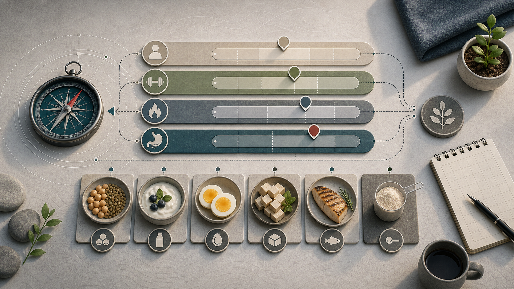
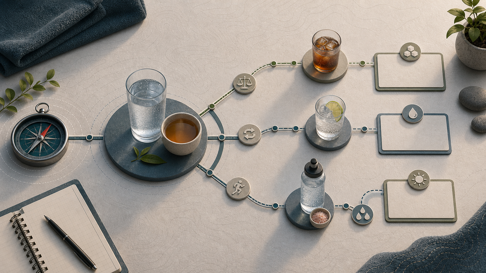
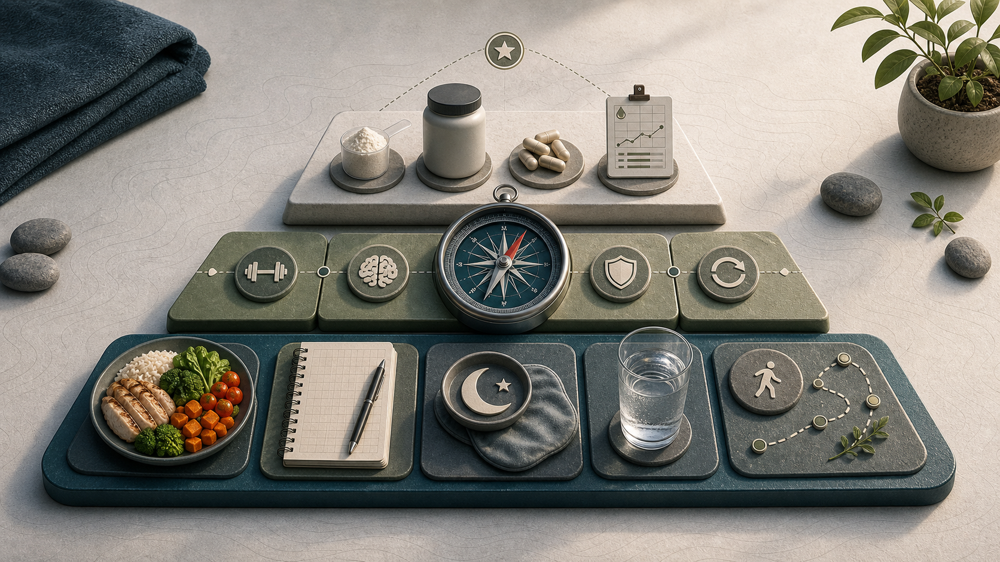

# 05 Ernährung

  

Ernährung muss im Alltag funktionieren, nicht nur in einer App oder auf einem perfekten Wochenplan. Gute Entscheidungen werden leichter, wenn die groben Hebel klar sind: Kalorienbilanz, genug Protein, ballaststoffreiche Lebensmittel, passende Kohlenhydrate, einfache Getränkeentscheidungen und ein flexibler Umgang mit Tracking. Dieses Kapitel legt die Ernährungsbasis. Messmethoden, Formeln und Tools stehen in [04 Tracking und Messung](04-tracking.md); geplante Fettabnahme wird in [06 Diätphase](06-diaetphase.md) beschrieben, kontrollierte Gewichtszunahme in [07 Massephase](07-massephase.md).

## 5.1 Kalorienbilanz steuert den Gewichtstrend

Körpergewicht verändert sich langfristig vor allem über die Energiebilanz. Einzelne Lebensmittel sind selten das Hauptproblem; Menge, Regelmäßigkeit, Sättigung und Umgebung zählen stärker.

Tageswerte sind dafür zu laut. Aussagekräftiger sind Trends über mehrere Wochen. Wie Gewicht, Taille, Kalorien und Makros sauber gemessen werden, steht gesammelt in [04 Tracking und Messung](04-tracking.md).

## 5.2 Protein absichern

Für gesunde Erwachsene von 19 bis unter 65 Jahren nennt die DGE 0,8 g Protein pro kg Körpergewicht und Tag als Referenzwert; für gesunde, normalgewichtige Menschen ab 65 Jahren nennt sie 1,0 g/kg/Tag als Schätzwert (<a href="https://www.dge.de/presse/meldungen/2020/positionspapier-zur-proteinzufuhr-im-sport/">DGE 2020</a>). Diese Werte sichern die allgemeine Basis ab. Sie sind nicht automatisch optimale Zielwerte für Krafttraining, Diät, Muskelaufbau, hohe Sättigung oder bestmöglichen Muskelerhalt. Bei Sportlerinnen und Sportlern mit mehr als 5 Stunden Training pro Woche empfiehlt die DGE je nach Ziel und Trainingszustand 1,2-2,0 g/kg/Tag (<a href="https://www.dge.de/presse/meldungen/2020/positionspapier-zur-proteinzufuhr-im-sport/">DGE 2020</a>). Die ISSN nennt für die meisten trainierenden Personen 1,4-2,0 g/kg/Tag als sinnvollen Bereich (<a href="https://jissn.biomedcentral.com/articles/10.1186/s12970-017-0177-8">ISSN 2017a</a>).

**Zielbereiche:**

- **Allgemeine Gesundheit:** 19 bis unter 65 Jahre etwa 0,8 g/kg/Tag; ab 65 Jahren etwa 1,0 g/kg/Tag als DGE-Schätzwert. Praktisch sind das Untergrenzen für grundlegende Versorgung, nicht die Oberkante dessen, was sinnvoll sein kann.
- **Krafttraining/Muskelaufbau:** häufig 1,6-2,0 g/kg/Tag.
- **Diät/Fettverlust:** häufig 1,8-2,2 g/kg/Tag, besonders bei Krafttraining, schlankeren Ausgangslagen und hohem Sättigungsbedarf; sportnahe Empfehlungen für Natural-Bodybuilding-Diäten liegen in diesem Bereich, sind aber nicht automatisch auf jede normale Diät übertragbar (<a href="https://pubmed.ncbi.nlm.nih.gov/24864135/">Helms et al. 2014</a>).
- **Sehr hohe Werte:** nur gezielt einsetzen, wenn Ernährung, Nierenfunktion, Flüssigkeitszufuhr und Kontext passen.

Wer trainiert, abnehmen will, älter ist, wenig Muskelmasse hat oder hohe Sättigung braucht, liegt oft sinnvoll über der reinen Basisabsicherung. Bei starkem Übergewicht kann eine Berechnung nach Zielgewicht oder fettfreier Masse sinnvoller sein als eine starre Rechnung mit aktuellem Körpergewicht.

Praktisch heißt das: pro Hauptmahlzeit eine klare Proteinquelle einbauen, zum Beispiel Skyr/Quark, Eier, Fisch, Fleisch, Tofu/Tempeh, Hülsenfrüchte oder Proteinpulver bei Bedarf.

  

*Abbildung: Proteinbereiche sind Kontextwerte: Basisversorgung, Training, Diät und höherer Sättigungsbedarf verlangen unterschiedliche Einordnung.*

## 5.3 Pflanzenbetont essen

Die DGE empfiehlt eine Ernährung, die überwiegend aus pflanzlichen Lebensmitteln besteht. Dazu gehören Obst, Gemüse, Vollkorn, Hülsenfrüchte, Nüsse, Samen und pflanzliche Öle (<a href="https://www.dge.de/gesunde-ernaehrung/gut-essen-und-trinken/dge-empfehlungen/">DGE 2024a</a>; <a href="https://www.dge.de/gesunde-ernaehrung/gut-essen-und-trinken/dge-ernaehrungskreis/">DGE 2024b</a>; <a href="https://www.dge.de/presse/meldungen/2024/gut-essen-und-trinken-dge-stellt-neue-lebensmittelbezogene-ernaehrungsempfehlungen-fuer-deutschland-vor/">DGE 2024d</a>).

Für den Alltag reicht ein einfaches Raster: Jede Hauptmahlzeit besteht aus Proteinquelle, Gemüse oder Obst, sättigenden Kohlenhydraten und einer sinnvollen Fettquelle.

## 5.4 Obst und Gemüse täglich priorisieren

Mindestens 5 Portionen Obst und Gemüse pro Tag sind ein guter Marker für Mikronährstoffe, Ballaststoffe, Volumen und Sättigung (<a href="https://www.dge.de/gesunde-ernaehrung/gut-essen-und-trinken/dge-empfehlungen/">DGE 2024a</a>). Ein einfacher Start sind eine Portion Obst zum Frühstück, Gemüse oder Salat zu Mittag und Abendessen und Tiefkühlgemüse als Reserve.

## 5.5 Ballaststoffe ernst nehmen

Für Erwachsene gilt ein Richtwert von mindestens 30 g Ballaststoffen pro Tag. Ballaststoffe unterstützen Sättigung, Darmgesundheit und Stoffwechselgesundheit (<a href="https://www.dge.de/wissenschaft/faqs/ausgewaehlte-fragen-und-antworten-zu-ballaststoffen/">DGE o. J.</a>). Gute Alltagsquellen sind Haferflocken, Vollkornbrot, Linsen, Bohnen, Kichererbsen, Kartoffeln, Beeren, Gemüse, Nüsse und Leinsamen.

## 5.6 Getränke simpel halten

Die DGE empfiehlt rund 1,5 Liter Flüssigkeit pro Tag, am besten Wasser oder ungesüßten Tee (<a href="https://www.dge.de/gesunde-ernaehrung/gut-essen-und-trinken/dge-empfehlungen/">DGE 2024a</a>). Für Sportlerinnen und Sportler kann der Bedarf durch Körpergröße, Hitze, Schweißrate und Trainingsumfang deutlich höher liegen; 3-5 Liter pro Tag können an langen Trainings- oder Hitzetagen plausibel sein (<a href="https://pubmed.ncbi.nlm.nih.gov/17277604/">ACSM 2007</a>).

Im Alltag hält die Regel "Getränke sind kalorienfrei" vieles einfach. Wasser, Mineralwasser, ungesüßter Tee und schwarzer Kaffee sind die Basis; zuckerhaltige Getränke, Saft, Smoothies, Milchshakes und Alkohol sind Kalorienquellen und sollten bewusst eingeplant werden.

**Zero-Getränke:** Wenn die echte Alternative ein Zuckergetränk ist, sind Zero-Getränke für Kalorienbilanz und Diätsteuerung klar die bessere Wahl. Süßstoffe sind deutlich süßer als Zucker und werden deshalb in sehr kleinen Mengen eingesetzt; zugelassene Süßstoffe liefern keine oder kaum Energie und erhöhen im Allgemeinen den Blutzucker nicht relevant (<a href="https://www.fda.gov/food/food-additives-petitions/high-intensity-sweeteners">FDA 2017</a>). Das heißt nicht, dass Zero-Getränke "gesund machen". Sie sind ein Werkzeug, um Zucker und Flüssigkalorien zu ersetzen.

**Was im Körper passiert:** Süßstoffe sind keine einheitliche Stoffklasse. Aspartam wird im Darm rasch in Phenylalanin, Asparaginsäure und Methanol zerlegt; diese Stoffe kommen auch in normalen Lebensmitteln vor. Für Menschen mit Phenylketonurie (PKU) ist Aspartam wegen Phenylalanin relevant und muss gemieden bzw. streng begrenzt werden (<a href="https://www.efsa.europa.eu/en/press/news/131210">EFSA 2013</a>; <a href="https://www.fda.gov/food/food-additives-petitions/high-intensity-sweeteners">FDA 2017</a>). Andere Süßstoffe wie Sucralose, Acesulfam-K oder Steviolglykoside werden anders verstoffwechselt; gemeinsam ist vor allem, dass sie sehr hohe Süßkraft bei wenig oder keiner Energie liefern.

**Was belegt ist:** Randomisierte Studien und systematische Reviews sprechen dafür, dass Süßstoffe kurzfristig Zucker- und Energiezufuhr senken können, wenn sie Zucker ersetzen; besonders klar ist der Nutzen, wenn Zero-Getränke statt zuckergesüßter Getränke getrunken werden (<a href="https://www.who.int/publications/i/item/9789240046429">WHO 2022</a>; <a href="https://jamanetwork.com/journals/jamanetworkopen/fullarticle/2790045">McGlynn et al. 2022</a>). Nicht belegt ist, dass Süßstoffe unabhängig von der Kalorienbilanz Fettverlust auslösen, den Stoffwechsel "zerstören" oder automatisch Heißhunger verursachen. Die WHO empfiehlt Süßstoffe nicht als eigenständige Langzeitstrategie zur Gewichtskontrolle oder Prävention chronischer Erkrankungen, weil langfristige Vorteile auf Körperfett nicht klar belegt sind und Beobachtungsdaten unsicher bleiben (<a href="https://www.ncbi.nlm.nih.gov/books/NBK592246/">WHO 2023</a>).

**Pragmatische Regel:** Wasser bleibt Standard. Zero-Getränke sind sinnvoll, wenn sie Zuckergetränke, Saft, Eistee, Energy-Drinks oder Alkoholkalorien ersetzen. Sie sind weniger sinnvoll, wenn sie nur zusätzlich kommen, Süßhunger triggern oder als Ausrede dienen, an anderer Stelle mehr zu essen.

**Sport-Kontext:** Bei kurzen Einheiten reicht meist Wasser. Bei langen Einheiten über etwa 60-90 Minuten, hoher Hitze, starkem Schwitzen oder mehreren Einheiten pro Tag können Elektrolyte sinnvoll sein. Natrium ist dabei der wichtigste Schweiß-Elektrolyt; es unterstützt Flüssigkeitsaufnahme und Flüssigkeitsbindung. Flüssigkalorien in Sportdrinks sind dann keine Alltagsgetränke, sondern gezielte Energiezufuhr während Belastung (<a href="https://pubmed.ncbi.nlm.nih.gov/17277604/">ACSM 2007</a>; <a href="https://jissn.biomedcentral.com/articles/10.1186/s12970-017-0189-4">ISSN 2017b</a>).

**Warnsignal:** Nicht zwanghaft übertrinken. Bei langen Ausdauereinheiten ist zu viel Wasser ohne ausreichend Natrium problematisch, weil es das Risiko für Hyponatriämie erhöhen kann (<a href="https://pubmed.ncbi.nlm.nih.gov/17277604/">ACSM 2007</a>).

  

*Abbildung: Getränke bleiben zuerst Wasser und ungesüßter Tee; Zero-Getränke, Elektrolyte und Sportdrinks sind situationsabhängige Werkzeuge.*

## 5.7 Kohlenhydrate als Trainingsenergie nutzen

Kohlenhydrate sind kein Gegenspieler von Gesundheit oder Fettverlust. Sie sind der wichtigste schnell verfügbare Trainingsbrennstoff für Krafttraining mit hohem Volumen, intensive Einheiten, Laufen und Sportarten mit wiederholten Belastungsspitzen (<a href="https://jissn.biomedcentral.com/articles/10.1186/s12970-017-0189-4">ISSN 2017b</a>; <a href="https://jissn.biomedcentral.com/articles/10.1186/s12970-017-0177-8">ISSN 2017a</a>).

**Vor dem Training:** 2-4 Stunden vor dem Training ist eine Mahlzeit aus Kohlenhydraten plus Protein sinnvoll, z. B. Reis/Kartoffeln/Hafer/Brot/Pasta plus eine Proteinquelle. Wenn die letzte Mahlzeit lange her ist, kann 30-60 Minuten vorher ein kleiner Snack helfen, z. B. Banane, Brot, Reiswaffeln oder etwas leicht Verdauliches (<a href="https://jissn.biomedcentral.com/articles/10.1186/s12970-017-0189-4">ISSN 2017b</a>).

**Nach dem Training:** Kohlenhydrate nach dem Training füllen Muskelglykogen wieder auf. Für Muskelaufbau ist das vor allem indirekt wichtig: Bessere Glykogenverfügbarkeit unterstützt Trainingsleistung, Trainingsvolumen, Erholung und damit den nächsten wirksamen Trainingsreiz. Der direkte Hauptreiz für Muskelproteinaufbau bleibt die Kombination aus Krafttraining und ausreichendem Protein (<a href="https://jissn.biomedcentral.com/articles/10.1186/s12970-017-0189-4">ISSN 2017b</a>; <a href="https://jissn.biomedcentral.com/articles/10.1186/s12970-017-0177-8">ISSN 2017a</a>).

Nach dem Training reicht meist eine normale Mahlzeit aus Protein plus Kohlenhydraten. Wichtiger wird das, wenn die Einheit lang oder sehr intensiv war, wenn am selben oder nächsten Tag wieder trainiert wird oder wenn Muskelaufbau mit Kalorienüberschuss das Ziel ist.

Ein zwingendes 30-Minuten-Fenster gibt es für normale Krafttrainingseinheiten nicht, wenn Tageskalorien und Tagesprotein passen. Je höher Trainingsvolumen, Ausdaueranteil und Einheitenfrequenz sind, desto wichtiger wird gezieltes Carb-Timing (<a href="https://jissn.biomedcentral.com/articles/10.1186/s12970-017-0189-4">ISSN 2017b</a>; <a href="https://jissn.biomedcentral.com/articles/10.1186/s12970-017-0177-8">ISSN 2017a</a>).

## 5.8 Fettqualität verbessern

Fette sind wichtig für Zellfunktionen, Hormonsystem und Sättigung. Entscheidend ist vor allem die Qualität und der Kontext der Ernährung. Rapsöl, Olivenöl, Nüsse, Samen, Avocado und Fisch sind gute Basisquellen; frittierte Snacks, Süßwaren und stark verarbeitete Fett-Zucker-Kombinationen sollten nicht die Basis sein.

## 5.9 Alkohol niedrig halten

Es gibt keine risikofreie Alkoholmenge. Wer nicht trinkt, sollte nicht anfangen; wer trinkt, sollte Menge und Häufigkeit niedrig halten (<a href="https://www.dge.de/gesunde-ernaehrung/faq/alkohol/">DGE 2024c</a>). Alkohol ist kein Regenerationsgetränk und verdient besonders in Diät-, Trainings- und Schlafphasen einen kritischen Blick.

## 5.10 Flexibilität einplanen

Eine Ernährung muss alltagstauglich bleiben. Ein zu perfekter Plan scheitert oft schneller als ein robuster Plan mit Spielraum. Lieblingsessen sollten eingeplant und nicht als "Cheat" behandelt werden; die Wochenbilanz zählt mehr als einzelne Mahlzeiten.

---

## 5.11 Ernährung in der Praxis

### 5.11.1 Teller-Modell

- **1/2 Teller:** Gemüse, Salat oder Obst.
- **1/4 Teller:** Proteinquelle.
- **1/4 Teller:** sättigende Kohlenhydrate.
- **Zusatz:** kleine, hochwertige Fettquelle.

### 5.11.2 Gewichtsziel separat planen

Wer Fett verlieren will, braucht kein neues Ernährungssystem, sondern eine geplante Anwendung der Basis: moderates Defizit, Protein, Krafttraining, Schritte, Schlaf und Trendkontrolle. Die Details stehen in [06 Diätphase](06-diaetphase.md).

Wer Muskeln aufbauen will, braucht ebenfalls keine andere Lebensmittelmoral, sondern genug Energie für Training und Regeneration. Wie Erhaltung, kontrollierte Massephase, klassische Massephase und Dirty Bulk praktisch einzuordnen sind, steht in [07 Massephase](07-massephase.md).

### 5.11.3 Supplements

Supplements ergänzen, ersetzen aber nicht Ernährung, Training, Schlaf und Konsistenz. Sinnvoll sind sie vor allem, wenn ein konkreter Bedarf, eine Versorgungslücke oder ein praktisches Problem vorliegt. Mehr ist nicht automatisch besser: Bei Mikronährstoffen zählen Blutwerte, Ernährungsmuster, Medikamente, Erkrankungen und sichere Obergrenzen.

**Sinnvolle Kandidaten:**

- **Protein/Whey:** praktisch, wenn Lebensmittel nicht reichen (<a href="https://www.dge.de/presse/meldungen/2020/positionspapier-zur-proteinzufuhr-im-sport/">DGE 2020</a>; <a href="https://jissn.biomedcentral.com/articles/10.1186/s12970-017-0177-8">ISSN 2017a</a>).
- **Kreatin-Monohydrat:** gut untersucht; häufig 3-5 g/Tag als einfache Praxisdosis (<a href="https://jissn.biomedcentral.com/articles/10.1186/s12970-017-0173-z">ISSN 2017c</a>).
- **Elektrolyte/Natrium:** situationsabhängig sinnvoll bei langen, heißen oder sehr schweißtreibenden Ausdauerbelastungen (<a href="https://pubmed.ncbi.nlm.nih.gov/17277604/">ACSM 2007</a>).
- **Vitamin D:** bei wenig Sonne, auffälligen Werten oder fachlicher Empfehlung prüfen; dauerhaft hohe Dosierungen nicht auf Verdacht nehmen. Das BfR nennt für Nahrungsergänzungsmittel vorsichtige Höchstmengen und betont, dass bei ausreichender Sonnenexposition und ausgewogener Ernährung oft keine Präparate nötig sind (<a href="https://www.bfr.bund.de/veroeffentlichung/ausgewaehlte-fragen-und-antworten-zu-vitamin-d/">BfR 2025a</a>; <a href="https://www.bfr.bund.de/lebensmittel-und-futtermittelsicherheit/bewertung-der-stofflichen-risiken-von-lebensmitteln/bewertung-von-lebensmittelinhaltsstoffen/bewertung-von-vitaminen-und-mineralstoffen-in-lebensmitteln-neu/">BfR 2025b</a>).
- **Vitamin B12:** bei veganer Ernährung praktisch Pflicht; bei sehr geringer Aufnahme tierischer Lebensmittel prüfen. Die DGE nennt Vitamin B12 als kritischen Nährstoff und verweist bei veganer Ernährung auf Präparate (<a href="https://www.dge.de/wissenschaft/referenzwerte/vitamin-b12/">DGE B12</a>; <a href="https://www.dge.de/gesunde-ernaehrung/faq/faqs-vegane-ernaehrung/">DGE vegan</a>).
- **Eisen, Omega-3 und andere Mikronährstoffe:** nicht pauschal nehmen, sondern Ernährung, Blutwerte, Symptome und Zielgruppe prüfen. Das gilt besonders bei starker Müdigkeit, veganer Ernährung, sehr niedriger Energiezufuhr, starker Menstruation, Medikamenten oder Erkrankungen.

**Nicht priorisieren:**

- Detox-Produkte.
- Fatburner.
- Testosteron-Booster ohne medizinischen Befund.
- teure Spezialprodukte ohne klaren Nutzen.

  

*Abbildung: Supplements stehen oben auf der Prioritätenleiter; sie ergänzen Basics, ersetzen sie aber nicht.*

---
