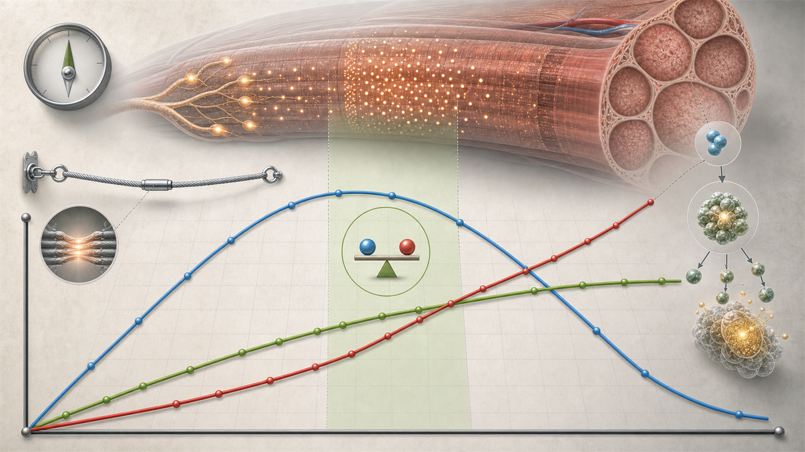

# 07 Krafttraining

<p align="center">
  
</p>

Krafttraining wird schnell kompliziert, wenn jeder Split, jede Methode und jede Übung gleich wichtig wirkt. Für den Alltag reicht ein klarerer Blick: Der Reiz muss hart genug, technisch sauber und über Wochen steigerbar sein, während Schlaf, Essen und Stress die Umsetzung tragen.

## 7.1 Krafttraining als Basis nutzen

Offizielle Bewegungsempfehlungen nennen muskelkräftigende Aktivitäten an mindestens zwei Tagen pro Woche. Krafttraining ist damit nicht nur Bodybuilding, sondern Gesundheitsbasis (<a href="https://www.bundesgesundheitsministerium.de/fileadmin/Dateien/5_Publikationen/Praevention/Broschueren/Konsenspapier_Runder_Tisch.pdf">BMG o. J.</a>; <a href="https://www.ncbi.nlm.nih.gov/books/NBK566046/">WHO 2020</a>). Für viele sind 2-4 Krafttrainingseinheiten pro Woche ein sinnvoller Zielbereich.

## 7.2 Regelmäßigkeit schlägt Perfektion

Ein solider Plan, der 12 Monate läuft, ist besser als ein idealer Plan, der nach 3 Wochen endet. Deshalb braucht jede Trainingsphase ein Minimalziel, zum Beispiel 2 Krafttrainings pro Woche auch in stressigen Phasen.

## 7.3 Ziel und Spezifität klären

Man wird gut in dem, was man trainiert. Bodybuilding, Maximalkraft, Spartan Race, Laufen und allgemeine Gesundheit brauchen unterschiedliche Schwerpunkte. Erst das Ziel definieren, dann Training danach sortieren: Muskelaufbau, Kraft, Fettverlust, OCR oder Gesundheit.

**Hypertrophie:** Hier geht es darum, Zielmuskeln über Wochen wirksam zu belasten und messbar aufzubauen. Mehr Gewicht ist hilfreich, aber Mittel zum Zweck; Kraftzuwachs ist nicht automatisch dasselbe Ziel wie maximale Kraftleistung.

**Powerlifting und Maximalkraft:** Powerlifting dreht sich praktisch um Kniebeuge, Bankdrücken und Kreuzheben. Dafür zählen Technik unter hoher Last, lange Satzpausen, niedrige bis mittlere Wiederholungsbereiche, planbare Belastungssteigerung und ausreichend Erholung. Muskelaufbau hilft, ersetzt aber nicht die spezifische Übungspraxis in den Wettkampfbewegungen. Schwere Sätze brauchen besonders saubere Ausführung und ein konservatives Schmerzmanagement (<a href="https://pubmed.ncbi.nlm.nih.gov/19204579/">ACSM 2009</a>).

**Explosivität und Power:** Explosivität bedeutet Kraft schnell entwickeln. Typische Werkzeuge sind Sprünge, Würfe, kurze Sprints, explosive Varianten einfacher Kraftübungen und bei guter Technik auch Gewichthebervarianten. Power-Arbeit gehört früh in die Einheit, wenn man frisch ist; sie braucht geringe Ermüdung, saubere Landungen, vollständige Pausen und niedrige Wiederholungszahlen. Mehr Erschöpfung macht explosive Arbeit nicht automatisch besser (<a href="https://www.nsca.com/about-us/position-statements/">NSCA Position Statements</a>; <a href="https://pubmed.ncbi.nlm.nih.gov/19204579/">ACSM 2009</a>).

**Mobilität und Dehnen:** Mobilität ist nutzbarer Bewegungsumfang unter Kontrolle, nicht nur passives Dehnen. Krafttraining über sinnvolle Bewegungsumfänge, kontrollierte Exzentrik, Aufwärmsätze, aktive Beweglichkeitsarbeit und gezieltes Stretching können alle sinnvoll sein. Dehnen ist kein Pflicht-Ritual vor jeder Einheit; es sollte ein konkretes Ziel haben, z. B. bessere Position in Kniebeuge, Overhead-Bewegung, Hüftstreckung oder schmerzfreie Alltagsbewegung. Für allgemeine Fitness empfiehlt ACSM auch Flexibilitäts- und neuromotorisches Training als Ergänzung zu Ausdauer und Kraft (<a href="https://pubmed.ncbi.nlm.nih.gov/21694556/">Garber et al. 2011</a>).

Wenn Ziele konkurrieren, braucht die Woche Prioritäten. Alles gleichzeitig maximal zu trainieren führt schnell zu schlechterer Erholung.

## 7.4 Hypertrophie verstehen: mTORC1, Spannung und Proteinaufbau

Muskelwachstum entsteht nicht durch maximalen Schmerz, sondern durch wiederholte, ausreichend hohe mechanische Spannung und anschließenden Proteinaufbau. Widerstandstraining wird im Muskel über Mechanotransduktion in molekulare Signale übersetzt; mTORC1 ist dabei ein zentraler Signalweg, der Muskelproteinsynthese und Zellwachstum mit antreibt (<a href="https://pmc.ncbi.nlm.nih.gov/articles/PMC12927080/">Van Every et al. 2025</a>; <a href="https://pubmed.ncbi.nlm.nih.gov/30335577/">Wackerhage et al. 2019</a>).

mTORC1 wird dabei nicht "ausgeschüttet", sondern in der belasteten Muskelfaser aktiviert. Vereinfacht ist es ein zelluläres Signal: Diese Faser wurde relevant belastet, Proteinaufbau lohnt sich. Das ist kein einzelner Ein-Aus-Schalter und nicht der einzige Mechanismus. Praktisch zählt, dass Training, Protein/Aminosäuren, Energieverfügbarkeit und Erholung zusammen dafür sorgen, dass Muskelproteinsynthese über Zeit den Muskelproteinabbau übersteigt (<a href="https://jissn.biomedcentral.com/articles/10.1186/s12970-017-0177-8">ISSN 2017a</a>; <a href="https://pmc.ncbi.nlm.nih.gov/articles/PMC12927080/">Van Every et al. 2025</a>).

**Ermüdung richtig einordnen:** Ermüdung ist nicht der eigentliche Wachstumsreiz. Sie kann aber dazu beitragen, dass in einem Satz mehr motorische Einheiten mitarbeiten müssen, besonders wenn Lasten moderat sind und der Satz näher Richtung technisches Versagen geht. Der eigentliche Reiz entsteht durch hohe mechanische Spannung in aktiv arbeitenden Fasern. Deshalb ist ein Satz mit ungefähr 2 Wiederholungen im Tank häufig schon produktiv: viele relevante Fasern arbeiten, ohne die maximalen Ermüdungskosten von echtem Versagen mitzunehmen (<a href="https://pubmed.ncbi.nlm.nih.gov/36334240/">Refalo et al. 2023</a>; <a href="https://pubmed.ncbi.nlm.nih.gov/28834797/">Schoenfeld et al. 2017b</a>).

Auch innerhalb einer Einheit ist nicht jeder weitere harte Satz für denselben Zielmuskel gleich wertvoll. Aufwärmsätze sind hier nicht gemeint. Die Grenzen sind grobe Arbeitsbereiche, keine exakte Physiologie: Je nach Übung, Muskelgruppe, Tagesform und Split können sie etwas früher oder später liegen.

| Satzbereich pro Zielmuskel in einer Einheit | Typische Logik | Praxis |
| --- | --- | --- |
| Satz 1-2 | hohe Leistungsfähigkeit, hohe mechanische Spannung möglich | nicht verschenken; sauber und hart genug trainieren |
| Satz 3-5 | genug Vorermüdung für hohe Rekrutierung, noch genug Leistung für produktive Spannung | häufig der effizienteste Bereich |
| Satz 6+ | zusätzlicher Reiz möglich, aber abnehmender Grenznutzen und steigende Ermüdungskosten | nur einsetzen, wenn Technik, ROM und Erholung stabil bleiben |

**Nicht verwechseln:** Muskelschäden, Muskelkater, "Übersäuerung", Brennen oder Pump sind keine notwendigen Ursachen und keine zuverlässigen Beweise für Muskelwachstum. Sie können bei harten Sätzen, kurzen Pausen, hohen Wiederholungen oder ungewohnter Exzentrik auftreten; wenn sie Technik, Volumen oder Regeneration verschlechtern, sind sie eher Kosten als Ziel (<a href="https://pubmed.ncbi.nlm.nih.gov/29282529/">Damas et al. 2018</a>; <a href="https://pmc.ncbi.nlm.nih.gov/articles/PMC12927080/">Van Every et al. 2025</a>).

Gute Hypertrophiearbeit fühlt sich oft hart an, muss aber nicht jedes Mal zerstörend sein. Ziel sind kontrollierte Wiederholungen, ausreichend harte Arbeitssätze, planbare Progression und genug Regeneration. Merksatz: Ermüdung hilft, Fasern zu rekrutieren; Wachstum entsteht durch mechanische Spannung. Ab einem gewissen Punkt steigt die Ermüdung stärker als der zusätzliche Wachstumsreiz.

<p align="center">
  
</p>

*Abbildung: Blau steht für den zusätzlichen Reiz pro Satz, rot für kumulative Ermüdung, grün für den kumulativen Gesamtstimulus. Der markierte Bereich zeigt den oft effizienteren Kompromiss aus Reiz und Ermüdung.*

## 7.5 Technik als Reizsteuerung verstehen

Saubere Ausführung ist kein Selbstzweck. Sie sorgt dafür, dass die Zielmuskulatur arbeitet und Gelenke nicht unnötig belastet werden. Kontrollierte Exzentrik, stabiler Bewegungsablauf und sinnvoller Bewegungsumfang sind deshalb Teil der Reizsteuerung.

## 7.6 Progression planen

Training muss über Zeit anspruchsvoller werden: mehr Wiederholungen, mehr Gewicht, bessere Technik, größerer Bewegungsumfang, mehr Sätze oder kürzere Pausen (<a href="https://pubmed.ncbi.nlm.nih.gov/19204579/">ACSM 2009</a>). Ein Trainingstagebuch macht diese Progression sichtbar; ohne Logbuch wird Fortschritt schnell zum Gefühl.

## 7.7 Belastung steuern: Volumen, RIR, Wiederholungen und Pausen

Muskelaufbau braucht genug harte Sätze und Nähe zum Muskelversagen, aber nicht jeder Satz muss maximal sein. Als Arbeitsgröße zählen harte Sätze pro Muskelgruppe und Woche: Aufwärmsätze zählen nicht, sehr leichte Technik- oder Pump-Sätze nur eingeschränkt. Reviews zeigen eine Dosis-Wirkungs-Beziehung zwischen wöchentlichem Satzvolumen und Hypertrophie, gleichzeitig ist die individuelle Erholung der begrenzende Faktor (<a href="https://pubmed.ncbi.nlm.nih.gov/27433992/">Schoenfeld et al. 2017a</a>; <a href="https://pmc.ncbi.nlm.nih.gov/articles/PMC8884877/">Baz-Valle et al. 2022</a>).

| Zielbereich | harte Sätze pro Muskelgruppe/Woche | typische RIR-Steuerung |
| --- | ---: | --- |
| Einstieg, Wiedereinstieg oder stressige Phasen | 6-10 | meist 2-4 RIR, Technik stabilisieren |
| Solider Hypertrophie-Startwert | 10-16 | meist 1-3 RIR, letzte Isolationssätze gelegentlich 0-1 RIR |
| Spezialisierung bei guter Erholung | 16-20 | überwiegend 1-2 RIR, nur einzelne Sätze bis 0 RIR |
| Dauerhaft darüber | 20+ | nur gezielt prüfen; oft steigt Ermüdung schneller als Nutzen |

Reps in Reserve (RIR) ist ein wertvolles Werkzeug, um harte Sätze reproduzierbar zu steuern. Viele Compound-Arbeitssätze funktionieren gut mit etwa 1-3 Wiederholungen im Tank; bei neuen Übungen, schwerer Technik oder hoher Wochenbelastung sind 2-4 RIR oft sinnvoller. Näher ans Muskelversagen passt eher bei stabilen Maschinen und Isolationsübungen. Wenn Leistung, Gelenkgefühl, Schlaf oder Motivation mehrere Wochen fallen, zuerst Volumen und 0-RIR-Sätze reduzieren statt noch härter zu drücken (<a href="https://pubmed.ncbi.nlm.nih.gov/36334240/">Refalo et al. 2023</a>).

**Wiederholungsbereich:** Für Hypertrophie ist der Bereich breiter als die klassische 8-12-Regel. Wenn Sätze ausreichend nah ans technische Versagen geführt werden, können niedrige, mittlere und hohe Wiederholungsbereiche Muskelaufbau auslösen; schwere Lasten sind für Maximalkraft spezifischer, sehr hohe Wiederholungen werden schneller durch Brennen, Atmung oder lokale Ausdauer begrenzt (<a href="https://pubmed.ncbi.nlm.nih.gov/28834797/">Schoenfeld et al. 2017b</a>; <a href="https://pubmed.ncbi.nlm.nih.gov/27174923/">Morton et al. 2016</a>; <a href="https://pubmed.ncbi.nlm.nih.gov/36334240/">Refalo et al. 2023</a>).

| Wiederholungen | Einordnung |
| ---: | --- |
| 1-4 | eher Kraft, Technik und schwere spezifische Last; für Hypertrophie möglich, aber oft ermüdender pro nützlichem Volumen |
| 5-8 | schwere Hypertrophiesätze, gut für Compounds, wenn Technik stabil bleibt |
| 8-15 | robuster Standardbereich für viele Übungen |
| 15-30 | sinnvoll für Maschinen, Kabelzüge, Isolationsübungen oder gelenkschonendere Arbeit |
| 30+ | kann funktionieren, ist aber oft unpraktisch und wird häufiger von Atem, Brennen oder Konzentration begrenzt |

Eine gute Faustregel: Ein Hypertrophiesatz sollte meistens mindestens etwa 5 saubere Wiederholungen zulassen und am Ende in die Nähe des technischen Versagens kommen. Die Idee, dass "die letzten 5 Wiederholungen" besonders wachstumsrelevant sind, ist als Heuristik brauchbar: Gemeint sind die Wiederholungen nahe am Limit, in denen hohe Rekrutierung und hohe Spannung zusammenkommen. Sie ist aber keine exakte Rechenregel. Die ersten Wiederholungen sind nicht wertlos; sie bringen den Satz erst in diesen harten Bereich und liefern Übungspraxis.

**Satzpausen:** Pausen sind kein Leerlauf, sondern sichern Leistung, Technik und Trainingsvolumen. Je schwerer die Übung, je näher der Satz am Versagen liegt und je stärker der nächste Satz von Technik abhängt, desto eher lohnt sich eine längere Pause. Bei Isolationsübungen, Maschinen oder zeitsparenden Blöcken können kürzere Pausen funktionieren, solange die Zielmuskulatur weiterhin sauber belastet wird (<a href="https://www.frontiersin.org/journals/sports-and-active-living/articles/10.3389/fspor.2024.1429789/full">Singer et al. 2024</a>; <a href="https://pubmed.ncbi.nlm.nih.gov/19204579/">ACSM 2009</a>).

| Situation | RIR/Belastung | sinnvoller Startbereich |
| --- | --- | ---: |
| Schwere Grundübungen: Kniebeuge, Kreuzheben, Bankdrücken, schwere Rows | 0-2 RIR, hohe Last, technisch anspruchsvoll | 2-4 Minuten, bei Maximalkraft eher 3-5 Minuten |
| Moderate Compound-Sätze für Hypertrophie | 1-3 RIR, kontrollierte Technik | 90-180 Sekunden |
| Isolationsübungen und stabile Maschinen | 0-2 RIR, wenig technische Komplexität | 60-120 Sekunden |
| Technik-, Aufwärm- oder Pump-Sätze | 3+ RIR oder bewusst leicht | 30-90 Sekunden |

Wenn der nächste Satz deutlich weniger Wiederholungen schafft, die Last unnötig fällt oder die Technik kippt, war die Pause für diesen Zweck wahrscheinlich zu kurz. Wenn Leistung stabil bleibt und die Zielmuskulatur arbeitet, muss eine Isolation nicht künstlich auf 3 Minuten gestreckt werden.

Dichte Methoden wie Cluster-Sets, Rest Redistribution, EMOMs, Supersätze und Drop-Sätze sind Werkzeuge für Zeitersparnis, Trainingsdichte, Ermüdungssteuerung oder Technikpraxis. Sie sind kein eigener Hypertrophie-Mechanismus. Sie funktionieren nur, wenn die normalen Variablen weiter stimmen: Übungsauswahl, Technik, Last, Wiederholungen, Satznähe zum Versagen, Gesamtvolumen und Regeneration. Reviews zu zeiteffizientem Krafttraining ordnen Drop-Sätze und Supersätze als brauchbare Methoden ein, um Trainingszeit zu sparen; gleichzeitig sind die Langzeiteffekte weniger gut untersucht als klassische Sätze (<a href="https://pubmed.ncbi.nlm.nih.gov/34125411/">Iversen et al. 2021</a>).

Man kann diese Werkzeuge nach ihrer Grundidee sortieren: Cluster-Sets, Rest Redistribution und gut dosierte EMOMs verteilen Pausen anders; Supersätze koppeln Übungen; Drop-Sätze verlängern einen Satz durch Lastreduktion. Mini-Sätze in Cluster- oder Rest-Redistribution-Strukturen sind im Logbuch nicht automatisch zusätzliche harte Sätze. Aussagekräftiger sind Gesamtwiederholungen, Last, RIR, Pausenstruktur und die Frage, ob Technik und Leistung stabiler wurden.

### 7.7.1 Cluster-Sets

Cluster-Sets teilen einen geplanten Satz in kleinere Wiederholungsgruppen mit kurzer Pause innerhalb des Satzes. Statt 6 Wiederholungen am Stück kann man z. B. 2+2+2 Wiederholungen mit 20-30 Sekunden Pause trainieren. Diese kurzen Pausen zählen nicht als vollständige Satzpause, sondern als Teil der Satzstruktur. Die Idee ist simpel: Man unterbricht den Ermüdungsanstieg kurz, bevor Wiederholungsgeschwindigkeit, Position oder Technik stark abfallen.

Das Wirkprinzip ist also nicht "mehr Reiz durch mehr Brennen", sondern bessere Qualität pro Wiederholung. Die kurze Pause erlaubt etwas Erholung im arbeitenden System, sodass mehr Wiederholungen mit ähnlicherer Geschwindigkeit und saubererer Ausführung möglich werden. Akute Studien und Reviews zeigen, dass Cluster-Strukturen Geschwindigkeitsverlust, mechanische Ermüdung, metabolische Belastung und wahrgenommene Anstrengung reduzieren können (<a href="https://pubmed.ncbi.nlm.nih.gov/32901442/">Jukic et al. 2020</a>; <a href="https://pubmed.ncbi.nlm.nih.gov/28828076/">Tufano et al. 2017</a>). Das passt besonders zu schweren Grundübungen, Power-Arbeit, Techniktraining und Situationen, in denen die Bewegungsgeschwindigkeit oder Position zu früh einbricht.

Sinnvoll sind Cluster-Sets vor allem, wenn die normale Satzform das falsche Problem erzeugt: Die Zielmuskulatur soll hart arbeiten, aber Technik, Bar-Speed, Atmung oder lokale Ermüdung kippen zu früh. Dann kann ein Cluster helfen, schwere oder explosive Arbeit reproduzierbarer zu machen. Weniger passend ist die Methode, wenn gerade die zusammenhängende Nähe zum technischen Versagen gewollt ist, etwa bei stabilen Maschinen oder Isolationsübungen.

Für Hypertrophie bleibt die Grenze wichtig: Wenn Volumen, Last, Nähe zum Versagen und Gesamtarbeit vergleichbar sind, zeigen Cluster-Strukturen meist keine klar bessere Muskelzunahme als traditionelle Sätze (<a href="https://pubmed.ncbi.nlm.nih.gov/33475986/">Davies et al. 2021</a>; <a href="https://pubmed.ncbi.nlm.nih.gov/33417154/">Jukic et al. 2021</a>; <a href="https://pubmed.ncbi.nlm.nih.gov/39932536/">Vargas-Molina et al. 2025</a>). Praktisch heißt das: Cluster-Sets nutzen, wenn sie Technik, Lastqualität oder Planung verbessern. Nicht nutzen, um schlechte Übungsauswahl, zu wenig harte Arbeit oder ein unpassendes Gesamtvolumen zu kaschieren.

Ein einfacher Start wäre bei Kniebeugen: statt 3 x 6 mit 2-3 Minuten Pause zwischen den Sätzen, 3 x (2+2+2) mit 20-30 Sekunden Pause innerhalb des Satzes und 2-3 Minuten zwischen den Sätzen. Im Logbuch sollten Last, Gesamtwiederholungen, RIR und Pausenstruktur stehen, damit der Vergleich zur normalen Variante möglich bleibt.

### 7.7.2 Rest Redistribution

Rest Redistribution verändert nicht zuerst die Übung, die Last oder die Gesamtwiederholungen, sondern die Verteilung der Pausenzeit. Aus 3 Sätzen mit 6 Wiederholungen und langen Pausen können z. B. 9 kleine Sätze mit 2 Wiederholungen und kürzeren Pausen werden. Die Gesamtarbeit bleibt ähnlich, aber die Ermüdung wird über mehr kurze Abschnitte verteilt.

Der Grundsatz dahinter: Nicht jede Pause muss zwischen großen Sätzen liegen. Wenn dieselbe Gesamtpause klüger verteilt wird, kann die Wiederholungsqualität gleichmäßiger bleiben. Akute Daten sprechen dafür, dass Rest Redistribution ähnlich wie Cluster-Strukturen Geschwindigkeitsverlust und Ermüdung reduzieren oder besser verteilen kann (<a href="https://pubmed.ncbi.nlm.nih.gov/32901442/">Jukic et al. 2020</a>; <a href="https://pubmed.ncbi.nlm.nih.gov/35368341/">Jukic et al. 2022</a>). Praktisch liegt die Methode näher an Mini-Sätzen oder EMOM-ähnlicher Organisation als an klassischen Arbeitssätzen.

Sinnvoll ist Rest Redistribution, wenn ein traditioneller Satz zu viel lokale Ermüdung ansammelt, obwohl man eigentlich saubere, ähnliche Wiederholungen sammeln will. Das kann bei Technikarbeit, schwereren Compounds, Pull-ups, Carries, Sprüngen oder Kraftausdauerblöcken nützlich sein. Es ist auch ein Organisationswerkzeug für knappe Zeitfenster: Man kann Arbeit dichter strukturieren, ohne jede Wiederholung in einen Ermüdungswettkampf zu verwandeln.

Die Grenze bleibt dieselbe wie bei Cluster-Sets: Rest Redistribution macht einen Satz nicht automatisch wirksamer für Muskelaufbau. Sie ist eine Organisationsform. Sinnvoll ist sie, wenn dadurch Lastqualität, Technik oder Wiederholbarkeit besser werden; weniger sinnvoll ist sie, wenn dadurch jeder Abschnitt zu leicht bleibt und die Zielmuskulatur nie ausreichend hart arbeiten muss.

### 7.7.3 EMOM

EMOM bedeutet "every minute on the minute": Zu Beginn jeder Minute wird ein festes kleines Wiederholungspaket ausgeführt, der Rest der Minute ist Pause. EMOM ist ein Zeitrahmen, kein Muskelaufbau-Trick. Sinnvoll wird er, wenn Last und Wiederholungen so gewählt werden, dass auch die letzten Minuten technisch sauber bleiben. Wenn Wiederholungen hektisch, langsamer oder unsauber werden, war das Paket zu schwer oder zu groß.

Ein einfacher Block wäre: 10 Minuten Goblet Squat EMOM, jede Minute 5 saubere Wiederholungen, danach bis zur nächsten Minute pausieren. Ergebnis: 50 technisch ähnliche Wiederholungen in 10 Minuten, ohne einen einzelnen Satz bis zum völligen Einbruch zu ziehen. Dafür eignet sich EMOM gut: viele saubere Wiederholungen sammeln, Bewegungsabläufe üben oder Zubehörarbeit knapp strukturieren.

Die direkte EMOM-Evidenz für Hypertrophie ist dünn. Praktisch kann ein gut dosierter EMOM einer Rest-Redistribution-Struktur ähneln, wenn kleine Wiederholungspakete mit kurzen, festen Pausen verteilt werden. Wenn aber jede Minute bis ans Muskelversagen geht, wird aus Technikpraxis schnell ein Ermüdungsblock. Für schwere Kniebeugen, Kreuzheben oder technisch anspruchsvolle Lifts sollte EMOM deshalb konservativ eingesetzt werden.

### 7.7.4 Supersätze

Supersätze koppeln zwei Übungen mit wenig oder keiner Pause dazwischen. Übung A wird ausgeführt, direkt danach Übung B, dann folgt die Pause. Am stabilsten funktionieren nicht konkurrierende oder antagonistische Paarungen, etwa Kabelrudern plus Kurzhantelbankdrücken, Beinbeuger plus Waden, Seitheben plus Trizepsdrücken oder Bauch plus Rückenstrecker. Je stärker beide Übungen dieselbe Zielmuskulatur belasten, desto eher sinken Wiederholungen, Last oder Technik.

Der Hauptnutzen ist Zeitersparnis. Drei Runden aus Kabelrudern mit 10-12 Wiederholungen und Kurzhantelbankdrücken mit 8-10 Wiederholungen ergeben sechs Arbeitssätze in weniger Zeit als klassische Einzelsätze. Eine aktuelle Meta-Analyse fand bei Supersätzen eine kürzere Trainingsdauer und höhere Trainingseffizienz bei ähnlichem Volumen und ähnlichen langfristigen Anpassungen in Kraft, Kraftausdauer und Hypertrophie; antagonistische Supersätze schnitten für den Erhalt der Wiederholungsleistung besser ab als Supersätze mit ähnlicher Biomechanik (<a href="https://pubmed.ncbi.nlm.nih.gov/39903375/">Zhang et al. 2025</a>).

Supersätze fühlen sich oft anstrengender an und können die Erholung zwischen Übungen verschlechtern. Für schwere Grundübungen, maximale Kraftarbeit oder neue Technik sind sie meist weniger passend. Für Isolationsübungen, Maschinen und nicht konkurrierende Paarungen sind sie oft die bessere Wahl.

### 7.7.5 Drop-Sätze

Drop-Sätze sind vor allem ein zeiteffizientes Werkzeug für Zubehörarbeit. Man führt einen Arbeitssatz nahe ans technische Limit, senkt das Gewicht sofort um etwa 15-30 % und arbeitet ohne lange Pause weiter. Praktisch reichen häufig 1-2 Drops. Beim Seitheben könnte das z. B. heißen: 12 Wiederholungen mit 12 kg bis etwa 0-1 RIR, direkt 8-10 Wiederholungen mit 9 kg, direkt 8-12 Wiederholungen mit 6 kg. Danach ist die Übung für diese Muskelgruppe meist erledigt oder fast erledigt.

Die Evidenz spricht dafür, dass Drop-Sätze ähnliche Hypertrophie wie traditionelle Sätze erzeugen können und dabei Trainingszeit sparen. Eine Meta-Analyse fand keine klare Überlegenheit gegenüber traditionellen Sätzen, aber teils deutlich kürzere Trainingsdauer; eine neuere Meta-Analyse fand vergleichbare Langzeitanpassungen bei höherer akuter Anstrengung und höheren Laktatwerten (<a href="https://pubmed.ncbi.nlm.nih.gov/37523092/">Sødal et al. 2023</a>; <a href="https://pubmed.ncbi.nlm.nih.gov/41920484/">Havers et al. 2026</a>). Ein kleines Pilotprojekt von Ozaki et al. nutzte bei untrainierten Männern einen schweren Satz plus mehrere Lastreduktionen bis 30 % 1RM und fand ähnliche Zuwächse der Muskelquerschnittsfläche wie bei klassischen schweren oder leichten Sätzen, bei kürzerer Trainingszeit (<a href="https://pubmed.ncbi.nlm.nih.gov/28532248/">Ozaki et al. 2018</a>).

Mehr Drops können für Kraftausdauer und metabolische Belastung sinnvoll sein, sind aber nicht automatisch mehr Hypertrophie. Für die Behauptung, 4-5 Drops seien für Hypertrophie besser als 2-3 Drops, gibt es aktuell keine robuste direkte Evidenz. Eine Studie verglich einen Single-Step- mit einem Multi-Step-Drop-Set-Protokoll; das Multi-Step-Protokoll verbesserte vor allem die Kraftausdauer, während Skelettmuskelmasse und Körperzusammensetzung zwischen den Gruppen ähnlich waren (<a href="https://sjsp.aearedo.es/index.php/sjsp/article/view/drop-set-training-muscle-performance-body-composition">Fasihiyan et al. 2023</a>). Deshalb passen Drop-Sätze eher ans Ende einer Übung, auf Maschinen, Kabelzüge oder Isolationsübungen. Bei schweren Grundübungen steigen Technik- und Erholungskosten schneller.

## 7.8 Werkzeuge, Bewegungsmuster und Prioritäten wählen

Langhantel, Kurzhantel, Kabelzug, Maschinen und Körpergewicht sind Werkzeuge. Entscheidend sind Reiz, Sicherheit und Fortschritt. Erst kommen Bewegungsmuster und Zielmuskulatur, dann das konkrete Gerät.

Ein robuster Plan deckt die großen Bewegungsmuster ab: Kniebeuge/Beinpresse, Hinge, Drücken, Ziehen, Core und Carry/Grip. Für Alltag, Haltung, Laufen, OCR/Spartan und langfristige Robustheit sind Beine, Rücken, hintere Kette und Griffkraft zentral. Rows, Pull-downs/Pull-ups, RDLs, Beinbeuger, Carries, Hängen, Waden und Core sollten deshalb regelmäßig vorkommen.

Welche Bewegung welche Muskulatur belastet und wie man Übungen dafür auswählt, wird in [08 Biomechanik und Übungsauswahl](08-biomechanik-uebungsauswahl.md) praktisch eingeordnet.

## 7.9 Regeneration als Grenze einplanen

Schlaf, Ernährung, Pausen, Deloads und Stressmanagement sind Teil des Trainingsplans. Regeneration entscheidet, ob ein Volumenbereich oder Split wirklich funktioniert. Wenn Leistung, Stimmung und Schlaf mehrere Wochen schlechter werden, sollte zuerst Belastung geprüft, Volumen reduziert und Schlaf priorisiert werden.

## 7.10 Trainingspläne und Split-Programme

Ein Split ist nur die Organisation der Trainingswoche. Er baut nicht automatisch mehr Muskeln auf, sondern verteilt die vorher festgelegten Sätze, Übungen und Erholungstage auf konkrete Trainingstage.

| Split | Typische Frequenz | Passt besonders gut, wenn | Grenze |
| --- | --- | --- | --- |
| **Ganzkörper (GK)** | 2-3x/Woche | wenig Trainingstage, Anfänger, Wiedereinstieg, stressige Phasen | einzelne Einheiten können lang werden |
| **Oberkörper/Unterkörper (OK/UK)** | 4x/Woche, auch 2x rotierend | planbare Woche, gute Balance aus Frequenz und Volumen | bei viel Ausdauer kann Unterkörper-Regeneration knapp werden |
| **OK/UK/GK** | 3x/Woche | drei Trainingstage, gute Mischung aus Struktur und Flexibilität | Volumen muss pro Einheit sauber priorisiert werden |
| **Push/Pull/Legs (PPL)** | 3-6x/Woche | hohe Trainingsfrequenz, klare Muskelgruppen, viele Übungen | bei 3x/Woche oft nur niedrige Muskel-Frequenz; bei 6x/Woche hoher Regenerationsbedarf |
| **Torso/Limbs** | 4x/Woche | Fokus auf Oberkörper plus separate Bein/Arm-Tage, bodybuilding-nah | Arme/Schultern können schnell zu viel Volumen sammeln |
| **Bro-Split** | 4-6x/Woche | fortgeschrittene Trainierende, hohe lokale Tagesvolumen, Spaß an Körperteil-Tagen | für viele Natural-Anfänger zu geringe Frequenz pro Muskel |
| **Arnold-Split** | 3-6x/Woche | Brust/Rücken, Schultern/Arme, Beine als wiederholte Blöcke | anspruchsvoll, viel Volumen, braucht gute Erholung |

**Auswahlregel:** 2 Trainingstage sprechen fast immer für Ganzkörper. 3 Trainingstage funktionieren gut mit Ganzkörper oder OK/UK/GK. 4 Trainingstage sind oft ideal für OK/UK oder Torso/Limbs. 5-6 Trainingstage können PPL oder Arnold-Split sinnvoll machen, wenn Schlaf, Essen und Alltag das Volumen wirklich tragen.

Nicht den Split optimieren, bevor die Basics stehen. Ein mittelmäßiger Split mit sauberem Logbuch, Progression und konstanter Umsetzung schlägt einen komplizierten Split ohne verlässliche Durchführung.

---

## 7.11 Wochenstruktur

Ausdauer wird in [09 Ausdauertraining](09-ausdauertraining.md) getrennt beschrieben. Die Wochenstruktur verbindet beide Reize trotzdem, weil Krafttraining, Laufen, Schlaf und Alltag in der Praxis um dieselbe Regeneration konkurrieren.

### 7.11.1 Minimal-Woche

Für stressige Phasen:

- 2x Krafttraining Ganzkörper.
- 2x lockere Ausdauer oder zügiges Gehen.
- tägliche kurze Bewegungspausen.
- 1-2 kurze Mobility- oder Warm-up-Routinen.

### 7.11.2 Standard-Woche

Für stabile Phasen:

- 3x Krafttraining.
- 2x Ausdauer, überwiegend locker.
- 1x optional Mobility, Technik, Grip, Core oder Carry.
- 1-2 ruhigere Tage.

### 7.11.3 Hybrid-Woche

Für Muskelaufbau plus Ausdauer/OCR:

- 3-4x Krafttraining.
- 2-3x Laufen oder Ausdauer.
- 1x Grip, Carries, Hangeln oder sportartspezifische Einheit.
- Belastung so steuern, dass Schlaf und Leistung nicht dauerhaft einbrechen.

## 7.12 Kontrolle: Trainingslog und Schmerzregel

Kontrolle schließt den Planungsbogen: Das Logbuch hält die wichtigsten Trainingsdaten fest; die Schmerzregel verhindert, dass Ehrgeiz Technik und Belastbarkeit überfährt.

### 7.12.1 Trainingslog

```text
Datum:
Schlaf / Energie:
Übung | Gewicht | Wiederholungen | Sätze | RIR/RPE | Notiz
Nächster Schritt:
```

### 7.12.2 Schmerzregel

- **Normal:** Muskelbrennen, Pump, lokale Ermüdung; kein Fortschrittsbeweis.
- **Warnsignal:** stechender Gelenkschmerz, ausstrahlender Schmerz, Taubheit, Instabilität.
- **Reaktion:** Technik, Volumen, Übungsauswahl und Belastung prüfen; bei wiederkehrenden Beschwerden fachlich abklären.

---
