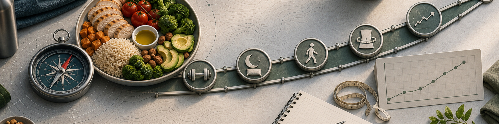

# 07 Massephase

  

Massephase bedeutet in diesem Kompass eine geplante Phase für Muskelaufbau, Trainingsleistung und kontrollierte Körpergewichtszunahme. Ziel ist nicht, möglichst schnell schwerer zu werden. Ziel ist, lange genug in einem kleinen Überschuss zu bleiben, damit Training und Regeneration profitieren, ohne unnötig viel Körperfett aufzubauen.

## 7.1 Erhaltung, Massephase und Dirty Bulk

Die Begriffe beschreiben nicht verschiedene Stoffwechselgesetze, sondern unterschiedliche Energieüberschüsse und Risikoprofile.

| Phase | Energieziel | Gewichtstrend | Einordnung |
| --- | --- | --- | --- |
| Erhaltung | ungefähr Erhaltungskalorien | stabiler 7-Tage-Trend | gut für Technik, Gewöhnung, Recomposition bei Einsteigern oder nach Diäten |
| Kontrollierte Massephase (Lean Bulk) | kleiner Überschuss, oft 100-300 kcal/Tag | langsam steigend | meist bester Standard für Natural-Muskelaufbau |
| Klassische Massephase (Bulk) | größerer Überschuss, oft 300-500 kcal/Tag | schneller steigend | kann bei sehr schlanken, aktiven oder schwer zunehmenden Personen passen, erhöht aber Fettaufbau |
| Dirty Bulk | unkontrollierter Überschuss | schnell steigend | meist schlechte Kosten-Nutzen-Rechnung: viel Fett, schlechtere Gesundheitsmarker, längere spätere Diät |

Erhaltungskalorien sind dabei kein exakter Punkt. Sie sind ein Bereich, in dem Gewicht über mehrere Wochen ungefähr stabil bleibt. Wer den eigenen Erhaltungswert noch nicht kennt, sollte zuerst die Mess- und Trendmethode aus [04 Tracking und Messung](04-tracking.md) nutzen und 2-3 Wochen Daten sammeln.

## 7.2 Muskelaufbau hat Grenzzunahmeverhalten

Muskelaufbau ist durch Trainingsreiz, Trainingsstatus, Genetik, Schlaf, Protein, Regeneration und Zeit begrenzt. Mehr Essen kann einen zu niedrigen Energiezustand korrigieren, aber es macht den Muskelaufbau nicht unbegrenzt schneller. Ab einem ausreichenden Überschuss landet zusätzliche Energie zunehmend als Fett.

Die Literatur ist hier vorsichtig, aber die Richtung ist klar. Eine Review zur Rolle des Energieüberschusses betont, dass Muskelaufbau im Defizit möglich sein kann, vor allem bei Untrainierten oder Personen mit höherem Körperfett, für trainierte und schlanke Personen aber oft ein konservativer Überschuss sinnvoll ist (<a href="https://www.frontiersin.org/journals/nutrition/articles/10.3389/fnut.2019.00131/full">Slater et al. 2019</a>). In einer Studie mit Eliteathleten führte höhere Energiezufuhr zu mehr Körpergewicht und deutlich mehr Fettmasse, aber nicht zu mehr fettfreier Masse als ein langsamerer Gewichtszuwachs (<a href="https://pubmed.ncbi.nlm.nih.gov/23679146/">Garthe et al. 2013</a>). Für Natural-Bodybuilder im Off-Season-Kontext empfiehlt eine Review deshalb einen eher kontrollierten Überschuss und langsame Gewichtszunahme (<a href="https://nutrition-evidence.com/article/325019/nutrition-recommendations-for-bodybuilders-in-the-off-season-a-narrative-review">Iraki et al. 2019</a>).

Praktisch heißt das: Wenn Gewicht und Bauchumfang schnell steigen, aber Trainingsleistung, Wiederholungen und Satzqualität kaum besser werden, ist der Überschuss wahrscheinlich größer als nötig.

## 7.3 Start- und Stoppkorridor

Für männliche, gesunde, trainierende Erwachsene ist der Start einer kontrollierten Massephase bei grob 12-15 % Körperfett oft ein brauchbarer Praxisbereich. Das ist eine Bodybuilding- und Coach-Heuristik, kein medizinischer Grenzwert. Unterhalb davon wird längeres Halten für viele anstrengend; oberhalb davon wird die Massephase kürzer, weil der nächste Cut schneller nötig wird. Als pragmatische Grenze ist um 20 % Körperfett häufig ein guter Zeitpunkt, die Massephase zu beenden oder auf Erhaltung zu gehen. Diese Bereiche gelten nicht automatisch für Frauen, andere Zielgruppen, andere Messmethoden oder Personen mit medizinischen Risiken.

Körperfettprozent sind Schätzwerte mit deutlicher Messunsicherheit. Für Gesundheit und Alltag sind Gewichtstrend, Taillenumfang, Blutdruck, Blutwerte, Schlaf und Leistungsfähigkeit oft robuster. Die zentralen Messmethoden und Warngrenzen stehen in [04 Tracking und Messung](04-tracking.md); die Risikoeinordnung steht in [12 Langlebigkeit und Risikofaktoren](12-langlebigkeit-risiken.md).

Der Grundsatz ist deshalb: möglichst lange kontrolliert aufbauen, aber nicht so lange, dass Taille, Gesundheit und spätere Diätkosten den Nutzen auffressen.

## 7.4 Überschuss wählen

Ein sinnvoller Start ist meist $\text{Erhaltung} + 100\text{-}300\,\text{kcal/Tag}$ oder etwa 5-10 % über Erhaltung. Nach 2-4 Wochen wird anhand des 7-Tage-Gewichtstrends angepasst. Natural-Bodybuilding-Empfehlungen nennen für Anfänger und Fortgeschrittene oft etwa 0,25-0,5 % Körpergewichtszunahme pro Woche; fortgeschrittene Athleten sollten konservativer sein, weil ihr mögliches Muskelwachstum langsamer wird (<a href="https://nutrition-evidence.com/article/325019/nutrition-recommendations-for-bodybuilders-in-the-off-season-a-narrative-review">Iraki et al. 2019</a>).

Für 80 kg Körpergewicht wären 0,25 % pro Woche etwa 0,2 kg, 0,5 % etwa 0,4 kg. Wer schon lange trainiert, kann sogar darunter liegen. Wenn der Trend schneller steigt, ist das nicht automatisch besser. Häufig bedeutet es nur, dass der spätere Cut länger wird.

## 7.5 Makros und Lebensmittelauswahl

Protein bleibt abgesichert. Für trainierende Personen nennt die ISSN 1,4-2,0 g/kg/Tag als häufig ausreichenden Bereich für Muskelaufbau und Muskelerhalt; in der Massephase ist mehr Protein nicht automatisch besser, wenn Tagesprotein bereits passt (<a href="https://jissn.biomedcentral.com/articles/10.1186/s12970-017-0177-8">ISSN 2017a</a>). Kohlenhydrate sind in der Massephase oft nützlich, weil sie Trainingsleistung, Volumen und Glykogenverfügbarkeit unterstützen. Fette bleiben wichtig, sollten aber nicht unbemerkt den Überschuss vervielfachen.

Kontrollierte Massephase heißt nicht, nur "saubere" Lebensmittel zu essen. Es heißt, dass die Basis aus normalen, nährstoffreichen Mahlzeiten besteht und energiedichte Extras gezielt eingesetzt werden: mehr Reis, Kartoffeln, Hafer, Brot, Pasta, Obst, Joghurt, Olivenöl, Nüsse oder ein zusätzlicher Snack. Flüssigkalorien, Süßwaren und Fast Food können zwar Kalorien liefern, machen die Steuerung aber oft schlechter.

## 7.6 Kontrolle und Stoppsignale

Eine Massephase braucht dieselben Messpunkte wie eine Diätphase, nur mit anderer Richtung. Die Details stehen in [04 Tracking und Messung](04-tracking.md): 7-Tage-Gewichtsschnitt, Taillenumfang, Trainingslog, Schlaf, Appetit, Verdauung, Blutdruck bei Bedarf und eine ehrliche Einschätzung der Trainingsprogression. Eine gute Massephase zeigt langsam steigendes Gewicht, stabilen oder nur moderat steigenden Bauchumfang und bessere Leistung bei wiederholbaren Übungen.

Stoppsignale sind ein schnell steigender Taillenumfang, deutlich schlechtere Kondition, hoher Blutdruck, schlechter Schlaf, häufiges Völlegefühl, sinkende Beweglichkeit oder mehrere Wochen Gewichtszunahme ohne Trainingsfortschritt. Dann ist Erhaltung, ein kleiner Mini-Cut oder eine Korrektur um 100-200 kcal sinnvoller als weiter zu essen, weil "Massephase" auf dem Plan steht.

## 7.7 Massephase beenden

Eine Massephase endet nicht erst, wenn man sich unwohl fühlt. Sie endet, wenn der zusätzliche Überschuss mehr Diätkosten erzeugt als Nutzen für den Muskelaufbau. Praktisch heißt das: bei grob 20 % Körperfett für Männer als Heuristik, stark steigendem Taillentrend oder ungünstigen Gesundheitsmarkern auf Erhaltung gehen und entscheiden, ob ein Cut sinnvoll ist.

Wer bei etwa 12-15 % startet, langsam zunimmt und bei etwa 18-20 % stoppt, kann oft mehrere Monate produktiv aufbauen. Wer bei 20 % startet und schnell zunimmt, muss meist früher wieder diäten. Die längere, kontrollierte Massephase ist deshalb meistens stärker als der schnelle Dirty Bulk mit langer Reparaturphase.

---
