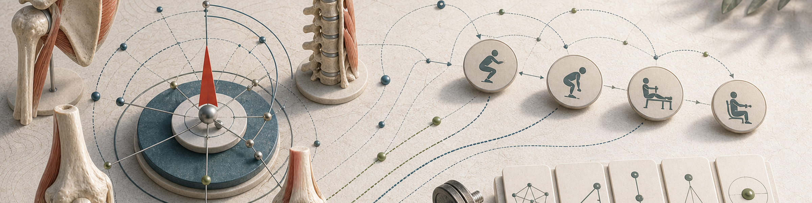
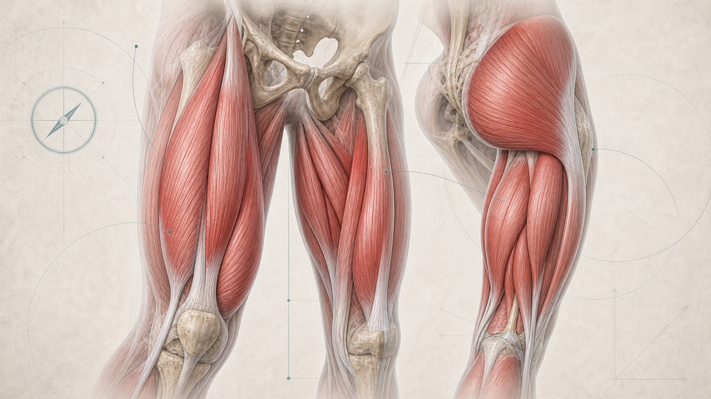
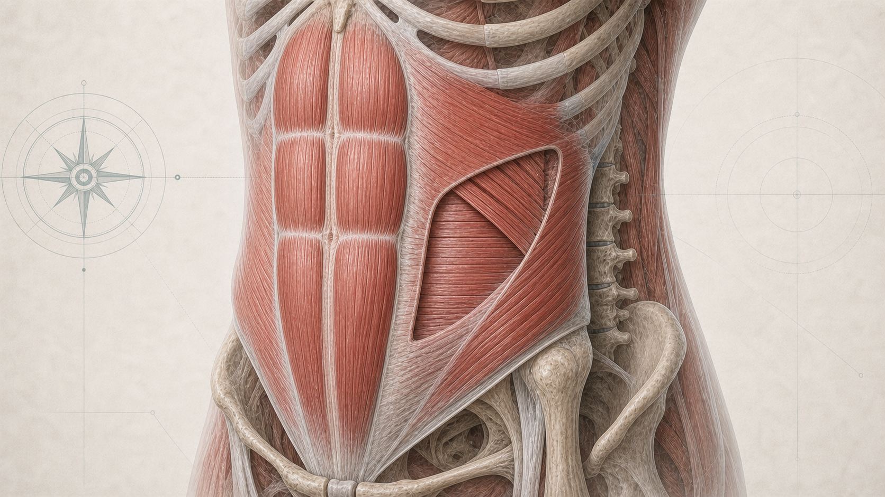
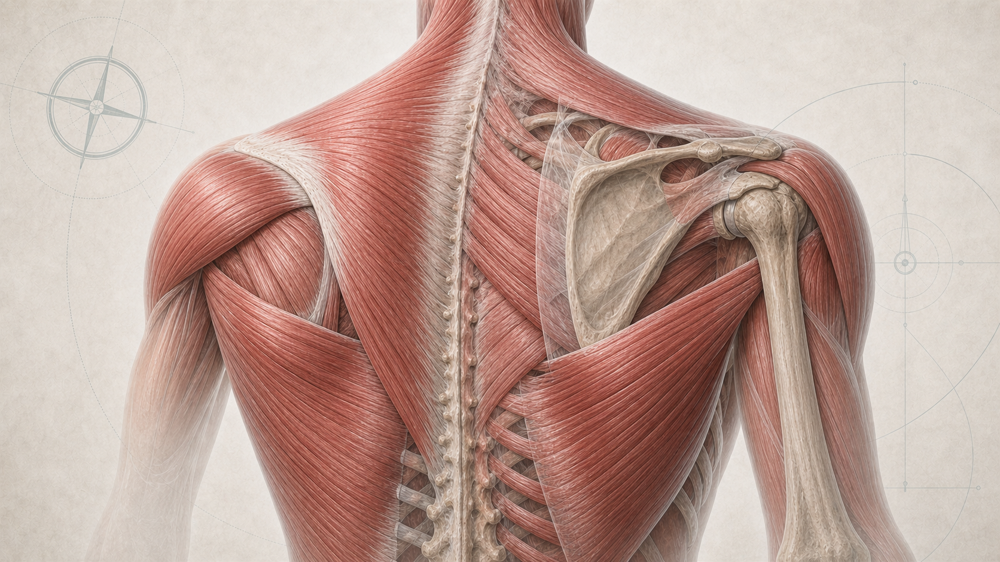
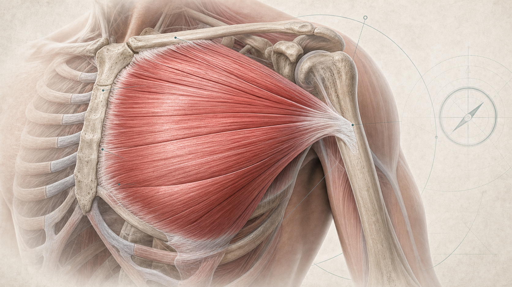
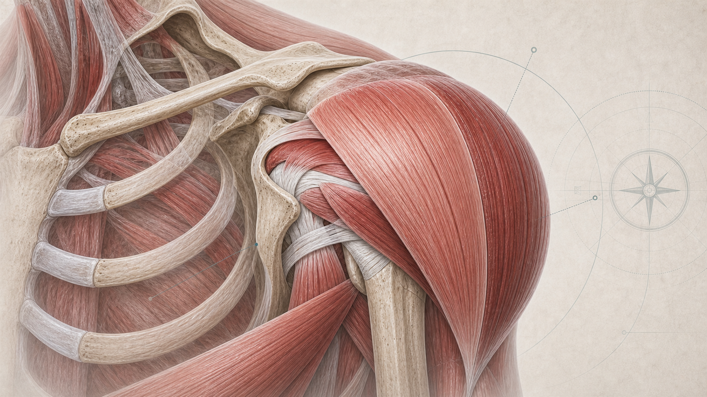
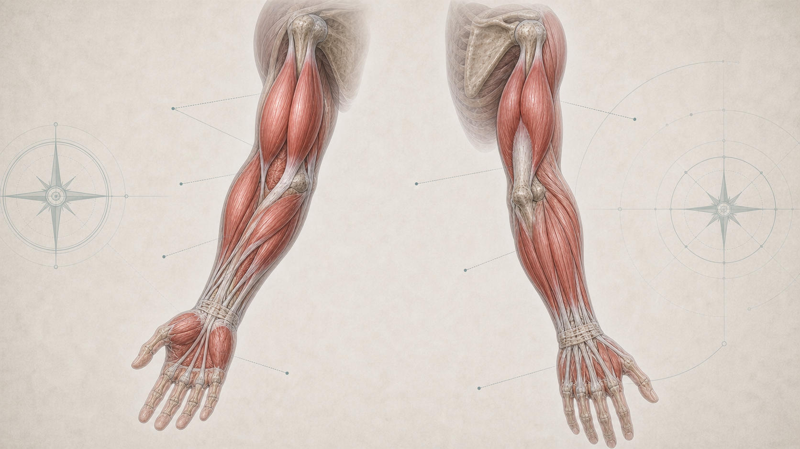
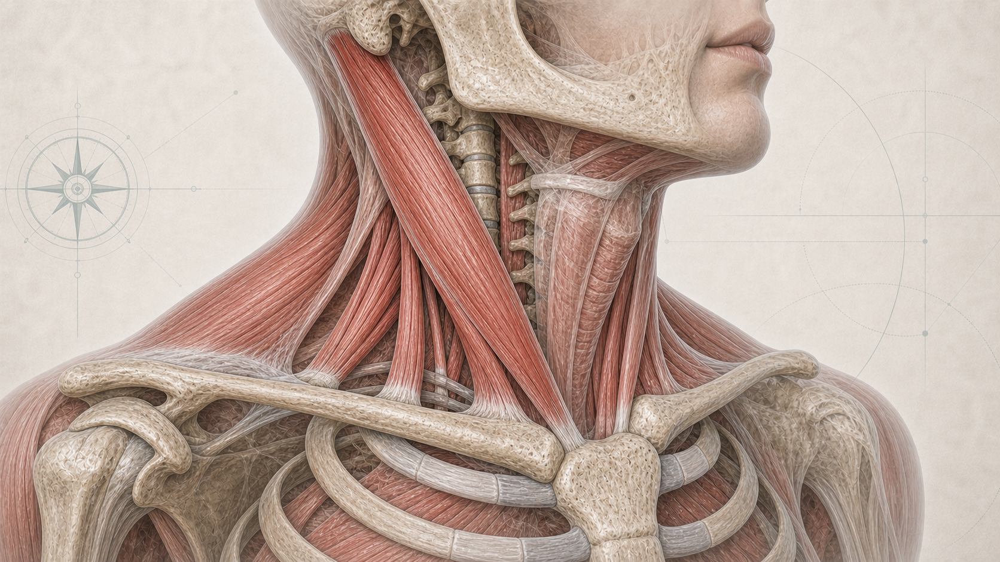

# 09 Biomechanik und Übungsauswahl

  

Biomechanik soll im Fitness-Kompass kein Anatomie-Lexikon ersetzen. Der praktische Nutzen ist einfacher: verstehen, welche Bewegung welchen Muskel belastet, warum eine Übung gut oder schlecht zum Ziel passt und wann eine zusätzliche Isolationsübung wirklich nötig ist.

Der Grundsatz bleibt: erst Bewegungsmuster sauber abdecken, dann Details optimieren. Für die meisten gesunden Erwachsenen reicht eine robuste Übungsauswahl, die Kniebeuge- oder Beinpresse-Muster, Hinge, Drücken, Ziehen, Rumpfstabilität und Griffkraft regelmäßig trainiert. Einzelne Muskeln, Winkel und Übungsreihenfolgen werden erst wichtig, wenn Ziel, Technik und Wiederholbarkeit schon stimmen.

## 9.1 Grundsatz: Bewegung vor Muskelnamen

Der Körper trainiert im Alltag keine isolierten Muskeln, sondern Bewegungen. Muskeln erzeugen Kraft, bremsen Bewegung ab und stabilisieren Gelenke; je nach Aufgabe arbeiten sie als Hauptbeweger, Unterstützer, Stabilisatoren oder Gegenspieler (<a href="https://openstax.org/books/anatomy-and-physiology-2e/pages/11-1-interactions-of-skeletal-muscles-their-fascicle-arrangement-and-their-lever-systems">OpenStax 2022a</a>). Eine Übung ist deshalb nicht automatisch gut, weil sie in einer Muskelgrafik bunt markiert ist. Sie ist gut, wenn sie den Zielmuskel zuverlässig belastet, technisch wiederholbar bleibt, über Wochen steigerbar ist und sich für Gelenke und Alltag vertretbar anfühlt.

Muskeln arbeiten selten allein. Bei einer Kniebeuge arbeiten Quadrizeps, Gesäß, Adduktoren, Rumpf und Rückenstrecker zusammen. Beim Rudern arbeiten Latissimus, mittlerer Rücken, hintere Schulter, Bizeps, Unterarme und Rumpf je nach Variante unterschiedlich stark. Für die Praxis ist deshalb wichtiger, welches Bewegungsmuster und welcher Engpass trainiert werden sollen, als eine Übung auf einen einzigen Muskel zu reduzieren.

## 9.2 Wie Muskeln praktisch arbeiten

Ein Muskel zieht über Sehnen an Knochen und bewegt dadurch ein oder mehrere Gelenke. Verkürzt sich der Muskel, arbeitet er konzentrisch; bremst er die Bewegung unter Last, arbeitet er exzentrisch; hält er Position, arbeitet er isometrisch. Alle drei Formen kommen im Krafttraining vor und werden vom Nervensystem über motorische Einheiten reguliert (<a href="https://openstax.org/books/anatomy-and-physiology-2e/pages/10-4-nervous-system-control-of-muscle-tension">OpenStax 2022b</a>).

Für Muskelaufbau zählt vor allem wiederholte mechanische Spannung in den belasteten Fasern. Das wird in [08 Krafttraining](08-krafttraining.md) genauer erklärt. Biomechanik ergänzt diese Logik: Ein Muskel bekommt nur dann einen guten Reiz, wenn die Übung ihn in einer Position belastet, in der er tatsächlich sinnvoll Kraft beitragen muss. Deshalb fühlen sich kleine Änderungen manchmal deutlich anders an: Griffbreite, Ellenbogenwinkel, Oberkörperneigung, Fußposition oder Bewegungsumfang verschieben Hebel und Zielmuskulatur.

Anatomische Details sind nützlich, aber nicht jede Person muss Ursprung, Ansatz und jeden Muskelkopf auswendig kennen. Häufig reicht die Frage: Welches Gelenk bewegt sich, in welche Richtung geht die Last, und welcher Muskel muss diese Bewegung erzeugen oder bremsen?

## 9.3 Verbundübungen und Isolation

Verbundübungen bewegen mehrere Gelenke und belasten mehrere Muskelgruppen gleichzeitig. Kniebeugen, Kreuzheben-Varianten, Bankdrücken, Schulterdrücken, Klimmzüge, Latzug, Rudern, Ausfallschritte und Carries sind deshalb zeiteffizient. Sie liefern viel Trainingsreiz, brauchen aber mehr Technik, Koordination und Regeneration.

Isolationsübungen bewegen meist ein Hauptgelenk und machen es leichter, einen Zielmuskel gezielt zu treffen. Seitheben, Beinbeuger, Beinstrecker, Bizepscurls, Trizepsdrücken, Butterfly und Wadenheben sind nicht "weniger funktionell", sondern Werkzeuge. Sie sind besonders sinnvoll, wenn ein Muskel in Verbundübungen zu wenig Reiz bekommt, wenn Gelenke geschont werden sollen oder wenn ein ästhetisches Ziel gezielt priorisiert wird. Übungsvariation und Übungsauswahl können Kraft- und Hypertrophieanpassungen beeinflussen, ersetzen aber nicht die Basisvariablen aus Volumen, Intensität, Technik und Progression (<a href="https://pubmed.ncbi.nlm.nih.gov/35438660/">Kassiano et al. 2022</a>).

| Entscheidung | Häufig sinnvoll | Grenze |
| --- | --- | --- |
| Wenig Zeit, allgemeine Fitness | zuerst Verbundübungen und große Bewegungsmuster abdecken | einzelne Muskeln können unterrepräsentiert bleiben |
| Muskel gezielt aufbauen | Verbundübung plus passende Isolation | nicht jede Faser braucht sofort Spezialübungen |
| Gelenk oder Technik limitiert | Maschine, Kabelzug oder stabilere Variante prüfen | Schmerz nicht mit mehr Willenskraft lösen |
| Fortgeschrittene Priorität | Zielmuskel früher in die Einheit legen | andere Übungen verlieren Leistung |

## 9.4 Unterkörper: Kniebeuge, Hinge und Ausfallschritt

Der Unterkörper lässt sich praktisch über drei große Muster verstehen: kniedominante Übungen, hüftdominante Übungen und einbeinige oder versetzte Varianten. Kniedominante Übungen wie Kniebeuge, Beinpresse oder Beinstrecker belasten vor allem den Quadrizeps, also die Kniestreckung. Hüftdominante Übungen wie rumänisches Kreuzheben, Hip Thrust oder Good Morning belasten stärker Gesäß und hintere Oberschenkel. Ausfallschritte, Split Squats und Step-ups verbinden beide Welten und fordern zusätzlich Stabilität.

  

*Abbildung: Quadrizeps, Gesäß, Hamstrings und Adduktoren arbeiten je nach Übung unterschiedlich zusammen. Knie- und Hüftwinkel entscheiden mit, ob der Reiz eher kniedominant oder hüftdominant wird.*

| Muskelgruppe | Hauptfunktion im Training | Einfache Übungsbeispiele |
| --- | --- | --- |
| Quadrizeps | Knie strecken, Beugebewegungen kontrollieren | Kniebeuge, Beinpresse, Hack Squat, Beinstrecker |
| Gluteus maximus | Hüfte strecken, Becken stabilisieren | Hip Thrust, Kniebeuge, Split Squat, rumänisches Kreuzheben |
| Hamstrings | Hüfte strecken und Knie beugen | rumänisches Kreuzheben, Beinbeuger, Good Morning |
| Adduktoren | Bein heranziehen, Hüfte und Becken stabilisieren | tiefe Kniebeuge, Beinpresse, Adduktorenmaschine, Cossack Squat |
| Waden | Sprunggelenk strecken, Abdruck beim Gehen und Laufen | stehendes und sitzendes Wadenheben, Sprünge, Treppen |

Kniebeuge und Beinpresse sind gute Grundwerkzeuge, aber sie ersetzen nicht automatisch jede hintere-Kette-Arbeit. Wer nur kniedominant trainiert, lässt Hamstrings und Hüftstreckung oft unterbelichtet. Umgekehrt ersetzt schweres Kreuzheben nicht immer ausreichend Quadrizepsarbeit. Ein robuster Plan enthält deshalb meist mindestens ein kniedominantes und ein hüftdominantes Muster.

## 9.5 Rumpf: Stabilität, Rotation und Übertragung

Der Rumpf ist mehr als sichtbare Bauchmuskulatur. Rectus abdominis, schräge Bauchmuskeln, Transversus abdominis, Rückenstrecker, Beckenboden, Zwerchfell und tiefe stabilisierende Strukturen helfen, Becken, Rippenkorb und Wirbelsäule unter Last zu kontrollieren. Im Alltag und Sport geht es häufig nicht darum, den Rumpf maximal zu bewegen, sondern Kraft zwischen Unter- und Oberkörper zu übertragen.

  

*Abbildung: Der Rumpf verbindet Rippenkorb, Wirbelsäule und Becken. Sichtbare Bauchmuskeln sind nur ein Teil davon; seitliche und tiefe Schichten tragen zur Kontrolle gegen Bewegung bei.*

Praktisch lassen sich vier Aufgaben unterscheiden:

1. **Beugung kontrollieren:** Crunches und Cable Crunches trainieren eher aktive Rumpfbeugung.
2. **Überstreckung verhindern:** Planks, Dead Bugs und Ab-Wheel-Varianten trainieren Anti-Extension.
3. **Rotation erzeugen oder bremsen:** Pallof Press, Carries und kontrollierte Rotationen trainieren Anti-Rotation und Kraftübertragung.
4. **Seitneigung kontrollieren:** Side Planks und einseitige Carries trainieren seitliche Stabilität.

Rumpftraining muss nicht jeden Tag maximal hart sein. Wenn schwere Kniebeugen, Kreuzheben, Rudern und Carries regelmäßig vorkommen, bekommt der Rumpf bereits viel Haltearbeit. Zusätzliche Core-Arbeit ist sinnvoll, wenn Stabilität, Sportanforderung, Rückengefühl oder Zielästhetik dafür sprechen. Wiederkehrender Rücken- oder Nervenschmerz ist ein Warnsignal und gehört nicht in ein Experiment mit immer härteren Bauchübungen.

## 9.6 Rücken: Ziehen, Rudern und Schulterblattkontrolle

Rückentraining besteht nicht nur aus "Lat treffen". Der Latissimus zieht den Oberarm nach unten, nach hinten und zum Körper; er wird bei Klimmzügen, Latzug und manchen Ruderbewegungen stark belastet. Der mittlere Rücken mit Rhomboiden und mittlerem Trapez bewegt und stabilisiert die Schulterblätter, besonders bei Ruderbewegungen. Der obere Trapez hilft bei Schulterblatthebung und -rotation; die hintere Schulter arbeitet stark bei breitem Rudern, Reverse Flys und Face-Pull-Varianten.

  

*Abbildung: Latissimus, Trapez, mittlerer Rücken und hintere Schulter liegen um Schulterblatt, Wirbelsäule und Oberarm. Zugwinkel und Schulterblattbewegung verschieben, welcher Anteil besonders stark arbeitet.*

Vertikales Ziehen wie Klimmzug oder Latzug ist ein einfacher Weg, den Latissimus regelmäßig zu belasten. Rudern ergänzt das durch horizontales Ziehen und mehr Arbeit für mittleren Rücken, hintere Schulter und Schulterblattkontrolle. Je enger die Ellenbogen am Körper bleiben, desto stärker fühlt sich Rudern oft lat-betont an. Je breiter die Ellenbogen laufen, desto stärker rücken hintere Schulter, oberer Rücken und Trapez in den Vordergrund.

Für Haltung und Schultergefühl zählt nicht nur "Schultern zurückziehen". Sinnvoller ist ein kräftiger, beweglicher Schultergürtel, der ziehen, drücken, heben und rotieren kann. Wenn Nacken, Schulter oder Ellenbogen regelmäßig gereizt reagieren, zuerst Griff, Bewegungsumfang, Last, Volumen und Übungsvariante prüfen.

## 9.7 Brust: Drücken und Adduktion

Der Pectoralis major bewegt den Oberarm vor den Körper und zur Körpermitte. Druckübungen wie Bankdrücken, Kurzhanteldrücken, Liegestütze und Dips belasten die Brust zusammen mit vorderer Schulter und Trizeps. Fly-Varianten wie Butterfly oder Kabel-Flys reduzieren den Trizepsanteil und machen horizontale Adduktion direkter spürbar.

  

*Abbildung: Der Pectoralis major zieht von Schlüsselbein, Brustbein und oberen Rippen zum Oberarm. Der Faserverlauf erklärt, warum Oberarmwinkel, Bankneigung und Fly-Varianten den Reiz verschieben können.*

Schrägbankdrücken verschiebt den Reiz häufig stärker in Richtung oberer Brust und vordere Schulter. Flachbank, leichte Schrägbank, Kurzhantelvarianten und Maschinen können alle funktionieren, wenn Bewegungsumfang, Kontrolle und Progression passen. Dips können brustbetonter werden, wenn der Oberkörper leicht nach vorne geneigt ist und die Ellenbogen nicht extrem eng geführt werden; aufrechtere Varianten verschieben den Reiz eher Richtung Trizeps und Schulter. Schultergefühl bleibt hier die Grenze.

Die Reihenfolge Butterfly vor Schrägbank oder Schrägbank vor Butterfly ist keine Glaubensfrage. Schrägbank zuerst passt, wenn Last, Progression und technische Qualität im Hauptlift Priorität haben. Butterfly zuerst kann sinnvoll sein, wenn die Brust besser gespürt werden soll oder wenn man mit geringeren Drücklasten arbeiten möchte; dafür sinkt meist die Leistung im anschließenden Drücken. Entscheidend ist, was über mehrere Wochen reproduzierbar besseren Zielreiz liefert.

## 9.8 Schulter: vordere, seitliche und hintere Anteile

Der Deltoideus hat grob drei praktische Rollen. Die vordere Schulter arbeitet stark bei Druckbewegungen wie Bankdrücken, Schrägbankdrücken und Schulterdrücken. Die seitliche Schulter hebt den Arm zur Seite und wird durch viele Grundübungen weniger vollständig abgedeckt. Die hintere Schulter zieht den Oberarm nach hinten und außen und arbeitet bei Rudern, Reverse Flys und Face Pulls.

  

*Abbildung: Der Deltoideus umschließt das Schultergelenk wie eine Kappe. Vordere, seitliche und hintere Fasern ziehen aus unterschiedlichen Richtungen am Oberarm und reagieren deshalb auf unterschiedliche Übungswinkel.*

Für viele Pläne ist die vordere Schulter bereits ausreichend oder sogar reichlich belastet. Die seitliche Schulter braucht dagegen oft direkte Arbeit, wenn Schulterbreite oder Optik ein Ziel ist. Seitheben mit Kurzhanteln, Kabel oder Maschine ist dafür meist einfacher als immer mehr Schulterdrücken. Hintere Schulter und oberer Rücken profitieren von Ruder- und Reverse-Fly-Varianten, besonders wenn viel gedrückt wird.

Die Rotatorenmanschette stabilisiert den Oberarmkopf im Schultergelenk. Sie muss nicht in jedem Plan mit vielen Spezialübungen trainiert werden, aber saubere Schulterkontrolle, passende Übungsvarianten und dosiertes Volumen sind wichtig. Stechender Schulterschmerz, Instabilität oder ausstrahlende Beschwerden sind Warnsignale.

## 9.9 Arme, Unterarme und Griffkraft

Arme werden bei Drücken und Ziehen bereits mittrainiert, aber direkte Arbeit kann sinnvoll sein. Der Bizeps beugt den Ellenbogen und dreht den Unterarm nach außen. Der Brachialis liegt unter dem Bizeps und beugt ebenfalls den Ellenbogen; Hammer Curls oder neutrale Griffvarianten treffen ihn oft gut. Der Trizeps streckt den Ellenbogen; der lange Kopf kreuzt zusätzlich das Schultergelenk und wird bei Überkopf-Varianten stärker in gedehnter Position belastet.

  

*Abbildung: Oberarm, Unterarm und Hand arbeiten bei Ziehen, Drücken und Greifen zusammen. Griffkraft hängt nicht nur an der Hand, sondern auch an Unterarmmuskeln, Sehnenverlauf und Ellenbogenposition.*

Unterarme und Griffkraft sind nicht nur Optik. Sie begrenzen oft Ziehübungen, Carries, Klettern, Hängen, OCR und Spartan-ähnliche Anforderungen. Farmer Carries, Suitcase Carries, Dead Hangs, Klimmzugvarianten, dickere Griffe und kontrollierte Curls können Griffkraft und Unterarme alltagstauglich trainieren.

Direkte Armarbeit muss zum Gesamtvolumen passen. Wer viel zieht, drückt und zusätzlich viele Curls und Trizepsübungen macht, merkt Überlastung oft zuerst an Ellenbogen oder Unterarmen. Dann sind Griff, Bewegungsumfang, Frequenz und Satznähe zum Versagen zu prüfen.

## 9.10 Nacken und Halsmuskulatur

Nacken und Halsmuskulatur stabilisieren Kopf, Halswirbelsäule und Schultergürtel. Der obere Trapez arbeitet bei Shrugs, Carries, schwerem Heben und vielen Zugbewegungen mit. Spezifisches Halsmuskeltraining kann in bestimmten Sportarten relevant sein, etwa Motorsport, Kampfsport oder Kontaktsport, weil Kopf- und Halskontrolle dort stärker gefordert sind.

  

*Abbildung: Halsmuskeln, oberer Trapez, Schlüsselbein, Schultergürtel und Halswirbelsäule bilden ein Stabilitätssystem. Für allgemeine Fitness ist dieser Bereich wichtig, aber selten ein früher Haupthebel.*

Für allgemeine Fitness ist direkter Halsaufbau selten ein früher Haupthebel. Ein kräftiger oberer Rücken, gute Schulterkontrolle, Carries und sinnvolle Zugübungen decken viel ab. Wer den Hals gezielt trainiert, sollte konservativ starten: kleine Bewegungsumfänge, niedrige Lasten, langsame Progression und keine Experimente bei Schwindel, ausstrahlendem Schmerz, Taubheit oder Kopfschmerz.

## 9.11 Effizienz: 80-90 % mit wenigen guten Übungen

Der Effizienz-Ansatz heißt nicht, dass Details egal sind. Er heißt, dass die meisten Fortschritte aus wenigen wiederholbaren Grundentscheidungen kommen. Ein Plan, der große Bewegungsmuster sauber abdeckt, ausreichend harte Sätze enthält und über Monate fortgeführt wird, ist für die meisten Ziele stärker als ein ständig wechselnder Spezialplan.

| Bewegungsmuster | Deckt grob ab | Beispiele |
| --- | --- | --- |
| Kniebeuge / Beinpresse | Quadrizeps, Gesäß, Adduktoren, Rumpf | Kniebeuge, Beinpresse, Hack Squat |
| Hinge | Hamstrings, Gesäß, Rückenstrecker | rumänisches Kreuzheben, Hip Thrust, Good Morning |
| Horizontales Drücken | Brust, vordere Schulter, Trizeps | Bankdrücken, Kurzhanteldrücken, Liegestütz |
| Vertikales oder horizontales Ziehen | Latissimus, oberer Rücken, hintere Schulter, Bizeps | Klimmzug, Latzug, Rudern |
| Schulter-Isolation | seitliche und hintere Schulter | Seitheben, Reverse Fly, Face Pull |
| Core / Carry / Grip | Rumpfkontrolle, Griffkraft, Übertragung | Pallof Press, Farmer Carry, Dead Hang |

Ein einfacher Ganzkörperplan kann damit bereits viel abdecken: Beinpresse oder Kniebeuge, rumänisches Kreuzheben oder Beinbeuger, Bankdrücken oder Liegestütze, Latzug oder Klimmzug, Rudern, Seitheben, eine Core- oder Carry-Variante. Wer nur zwei bis drei Krafttrainings pro Woche schafft, sollte zuerst diese Abdeckung stabilisieren. Spezialübungen kommen danach, wenn ein Zielmuskel trotz sauberer Grundstruktur hinterherhinkt.

## 9.12 Übungsreihenfolge, Vorermüdung und Prioritäten

Die Reihenfolge in einer Einheit steuert Aufmerksamkeit, Leistung und Ermüdung. Technisch anspruchsvolle, schwere oder priorisierte Übungen gehören meist früher in die Einheit; Reviews zur Übungsreihenfolge sprechen praktisch dafür, Übungen nach Trainingsziel und Priorität zu sortieren (<a href="https://pubmed.ncbi.nlm.nih.gov/32077380/">Nunes et al. 2020</a>). Isolationsübungen, Pump-Arbeit, Drop-Sätze oder kurze Supersatz-Blöcke passen häufig besser später, wenn die Hauptarbeit erledigt ist.

Vorermüdung kann ein Werkzeug sein, aber sie ist kein Pflichtprinzip. Die Literatur ist heterogen und zeigt keine einfache Regel, dass Vorermüdung grundsätzlich bessere Kraft- oder Hypertrophieanpassungen erzeugt (<a href="https://pmc.ncbi.nlm.nih.gov/articles/PMC9022698/">Trindade et al. 2022</a>). Wer vor dem Drücken Butterfly macht, kann die Brust stärker spüren und mit niedrigeren Drücklasten arbeiten. Gleichzeitig sinkt oft die Leistung in der anschließenden Verbundübung. Wer zuerst drückt, kann Last und Progression besser verfolgen, spürt die Brust aber nicht immer so klar. Beide Varianten können sinnvoll sein; der Kontext entscheidet.

Für Supersätze gilt dasselbe: Sie sparen Zeit, wenn die Übungen nicht zu stark konkurrieren. Kabelrudern plus Kurzhanteldrücken oder Seitheben plus Trizepsdrücken sind oft leichter zu steuern als zwei Übungen, die denselben Muskel direkt ermüden. Bei schwerer Technik, Maximalkraft oder neuen Bewegungen ist mehr Pause meist die bessere Entscheidung (<a href="https://pubmed.ncbi.nlm.nih.gov/39903375/">Zhang et al. 2025</a>).

---
