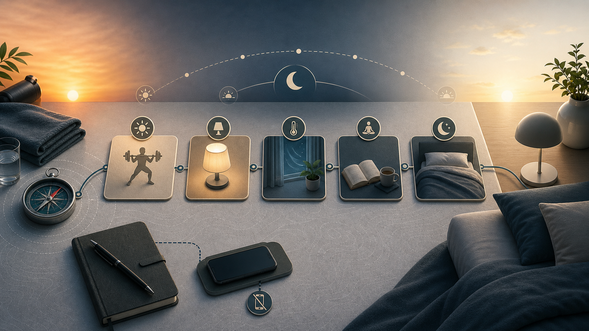
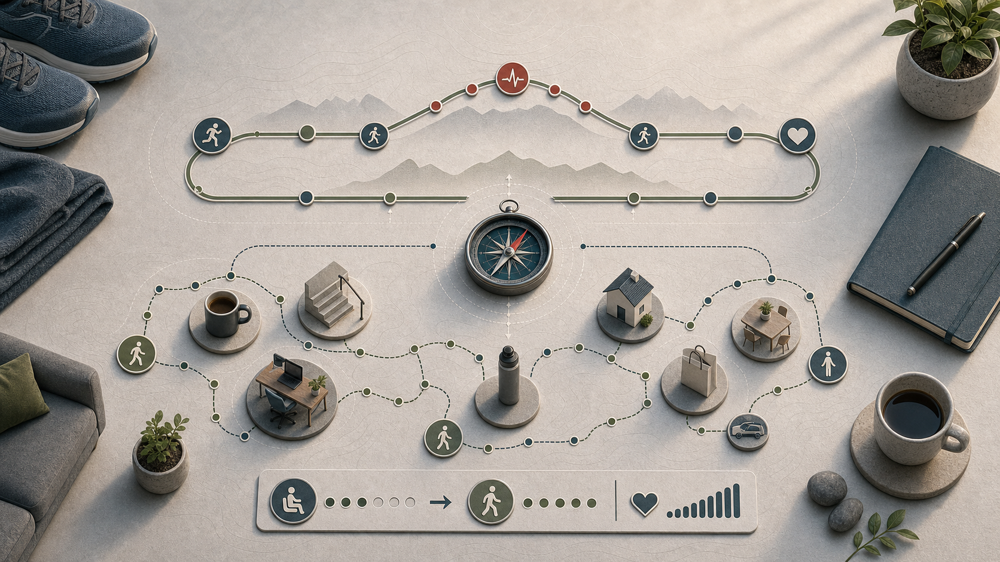

# 11 Gesundheit und Schlaf

  

Gesundheit ist der Teil des Plans, der selten laut wirkt, aber fast alles mitträgt. Schlaf, Alltagsbewegung, Stress, Schmerzen und medizinische Basischecks entscheiden oft darüber, ob Training und Ernährung stabil bleiben oder immer wieder aus dem Tritt geraten.

## 11.1 Schlaf als Haupthebel behandeln

Schlafmangel beeinträchtigt körperliche und geistige Leistungsfähigkeit, Psyche, Hungerregulation und Regeneration (<a href="https://gesund.bund.de/gut-schlafen">gesund.bund.de 2023</a>). Gesunde Erwachsene sollten regelmäßig 7 oder mehr Stunden schlafen (<a href="https://pmc.ncbi.nlm.nih.gov/articles/PMC4434546/">AASM/SRS 2015</a>); der individuelle Bedarf variiert. Entscheidend ist, ob man tagsüber erholt und leistungsfähig ist (<a href="https://gesund.bund.de/gut-schlafen">gesund.bund.de 2023</a>).

## 11.2 Schlafroutine vor Schlafhacks

Regelmäßige Zeiten, dunkler Raum, kühle Umgebung, Abendroutine und weniger spätes Koffein bringen oft mehr als Einzelhacks. Eine brauchbare Abendroutine senkt 60 Minuten vor dem Schlafen das Reizniveau: Licht, Arbeit, Essen, Alkohol und Doomscrolling prüfen.

## 11.3 Chronische Schlafprobleme abklären

Bei anhaltenden Ein- oder Durchschlafproblemen mit Tagesbeeinträchtigung kann eine Insomnie vorliegen. Die AWMF/DGSM-Leitlinie nennt kognitive Verhaltenstherapie für Insomnie als erste Behandlungsoption (<a href="https://register.awmf.org/assets/guidelines/063-003l_S3_Insomnie-bei-Erwachsenen_2025-04.pdf">AWMF/DGSM 2025</a>). Nicht monatelang nur mit Melatonin, Alkohol oder Schlafmitteln experimentieren.

  

*Abbildung: Schlafroutine heißt Reizniveau senken und wiederholbare Bedingungen schaffen, nicht jeden Abend neue Hacks testen.*

## 11.4 Alltagsbewegung und Schritte sammeln

Nicht nur Training zählt. Alltagsbewegung ist ein eigener Hebel für Gesundheit, Energieverbrauch und Diätsteuerung. Langes Sitzen sollte regelmäßig unterbrochen werden (<a href="https://www.bundesgesundheitsministerium.de/fileadmin/Dateien/5_Publikationen/Praevention/Broschueren/Konsenspapier_Runder_Tisch.pdf">BMG o. J.</a>; <a href="https://www.ncbi.nlm.nih.gov/books/NBK566046/">WHO 2020</a>).

Schritte sind niedrigschwellig, gut dosierbar und erzeugen im Vergleich zu zusätzlichem hartem Training meist wenig Regenerationskosten. In großen Kohortendaten ist eine höhere tägliche Schrittzahl mit niedrigerer Gesamtsterblichkeit verbunden; der Nutzen steigt nicht unbegrenzt linear, sondern flacht in höheren Bereichen ab (<a href="https://pmc.ncbi.nlm.nih.gov/articles/PMC9289978/">Paluch et al. 2022</a>). Daraus folgt kein magisches 10.000-Schritte-Gesetz, aber eine klare Richtung: mehr regelmäßige Bewegung ist für viele besser als sehr viel Sitzen.

In Diätphasen können Schritte helfen, ein moderates Energiedefizit zu erzeugen, ohne direkt die Essensmenge weiter zu senken. Das ist besonders nützlich, wenn Hunger, Müdigkeit oder Diätstress bereits hoch sind. Schritte ersetzen keine Kalorienbilanz, machen sie aber oft leichter steuerbar: 2.000 zusätzliche Schritte pro Tag sind kein riesiger Hebel, aber über Wochen ein stabiler, alltagstauglicher Beitrag.

Schritte sind Alltagsbewegung, Cardio ist gezieltes Ausdauertraining. Beides ist sinnvoll, aber nicht identisch. Schritte sind ideal, um Sitzen zu reduzieren und den täglichen Energieverbrauch sanft zu erhöhen. Cardio setzt stärkere Reize für Herz-Kreislauf-Fitness, VO2max, Laufleistung oder sportliche Ziele, kann aber je nach Intensität mehr Ermüdung und Planungsaufwand erzeugen. Appetitreaktionen auf Training sind individuell; Studien zeigen im Mittel keine einfache Regel, dass Training automatisch stark mehr Essen auslöst (<a href="https://pmc.ncbi.nlm.nih.gov/articles/PMC8365695/">Beaulieu et al. 2021</a>).

Erst 7 Tage den normalen Schnitt messen, dann in kleinen Stufen erhöhen, z. B. um 1.000-2.000 Schritte pro Tag. Gute Anker sind Telefonate im Gehen, 10 Minuten nach Mahlzeiten, kurze Spaziergänge, Treppen, weiter weg parken, eine Haltestelle früher aussteigen oder 2-5 Minuten Bewegung pro Stunde. In Diätphasen ist ein stabiler Schrittbereich oft hilfreicher als einzelne heroische Cardioeinheiten.

  

*Abbildung: Schritte sind alltagstaugliche Grundbewegung; Cardio ist ein gezielter Trainingsreiz mit eigener Belastungssteuerung.*

## 11.5 Stress als Belastung zählen

Stress beeinflusst Schlaf, Hungerregulation, Regeneration und Trainingsqualität. Er sollte deshalb nicht nur mental gesehen werden, sondern als echter Belastungsfaktor im Trainingsplan.

## 11.6 Medizinische Basis priorisieren

Vorsorge, Zahnstatus, Blutdruck, relevante Blutwerte und Impfstatus sind weniger spektakulär als Supplements, aber wichtiger. Bei Müdigkeit, Leistungsabfall, Schmerzen oder Symptomen nicht nur Training und Ernährung optimieren, sondern medizinische Ursachen prüfen.

## 11.7 Mentale Gesundheit und Bewegung

Bewegung ist ein robuster, gut belegter Faktor für psychische Gesundheit. Eine Netzwerk-Meta-Analyse über mehr als 200 randomisierte Studien zeigt, dass aerobes Training, Gehen, Krafttraining und Yoga Symptome leichter bis mittelschwerer Depressionen mit Effektstärken reduzieren, die mit Psychotherapie oder Antidepressiva vergleichbar sind (<a href="https://pmc.ncbi.nlm.nih.gov/articles/PMC11131084/">Noetel et al. 2024</a>). Die AWMF S3-Leitlinie Unipolare Depression empfiehlt aerobes Training und Krafttraining explizit als ergänzende Behandlungsoption (<a href="https://register.awmf.org/de/leitlinien/detail/nvl-005">AWMF NVL-005</a>). Bei schwerer oder chronischer Depression ist Sport allein nicht ausreichend und ersetzt keine Psychotherapie oder ärztliche Behandlung.

Bewegungsmangel ist dabei nicht nur das Gegenteil von Training, sondern ein eigenständiger Risikofaktor: Langes Sitzen über viele Stunden täglich ist in Dosis-Wirkungs-Analysen mit erhöhtem Depressions- und Angstrisiko verbunden (<a href="https://www.ncbi.nlm.nih.gov/books/NBK566046/">WHO 2020</a>). Das ergänzt, was in [11.4](#114-alltagsbewegung-und-schritte-sammeln) und [10 Ausdauertraining](10-ausdauertraining.md) zu Alltagsbewegung steht: Weniger Sitzen und regelmäßige Bewegung wirken auf psychische Gesundheit auch unterhalb einer Trainingsschwelle.

Für Frauen in der Perimenopause und den Jahren danach ist der Zusammenhang besonders relevant. Der Übergang zur Menopause ist biologisch mit einem erhöhten Risiko für depressive Phasen, Reizbarkeit und Angst verbunden — nicht nur als Reaktion auf Körperveränderungen, sondern weil hormonelle Schwankungen das serotonerge System und die Schlafregulation beeinflussen (<a href="https://pmc.ncbi.nlm.nih.gov/articles/PMC9889489/">Shobeiri et al. 2023</a>). Eine Meta-Analyse über 21 randomisierte Studien zeigt, dass regelmäßige Bewegung Depressions- und Angstsymptome in dieser Lebensphase messbar reduziert; neben aeroben Einheiten zeigen Mind-Body-Ansätze wie Yoga, Tai Chi und Pilates in dieser Gruppe besonders gute Evidenz (<a href="https://pmc.ncbi.nlm.nih.gov/articles/PMC11762881/">Hu et al. 2025</a>).

Übertraining kann das Bild umkehren: Wer die Belastung über Wochen zu hoch hält und zu wenig regeneriert, kann Stimmungstiefs, Reizbarkeit, Schlafstörungen und Antriebsmangel entwickeln, die neurobiologisch mit Erschöpfungszuständen verwandt sind. Wenn Leistung, Schlaf und Stimmung gleichzeitig über mehrere Wochen nachgeben, ist das ein Warnsignal — Trainingsbelastung und Regeneration sollten zuerst geprüft werden, bevor Intensität oder Volumen erhöht wird.

Bei anhaltenden Stimmungstiefs, Erschöpfung, Antriebsverlust oder Angstsymptomen, die über mehr als zwei Wochen bestehen, ist fachliche Abklärung wichtiger als jede Trainingsanpassung. Bewegung kann dann ein sinnvoller Baustein sein, ersetzt aber keine psychiatrische oder psychotherapeutische Einschätzung.

---
